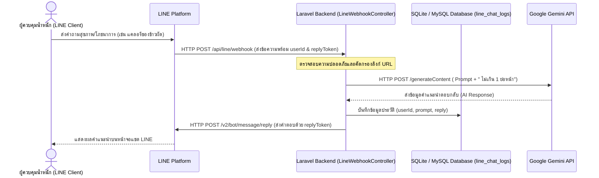

# บทที่ 3: วิธีดำเนินการวิจัย (Research Methodology)

การศึกษาวิจัยครั้งนี้ เป็นการวิจัยและพัฒนา (Research and Development: R&D) เพื่อศึกษาข้อมูลผลกระทบในเขตพื้นที่ลุ่มน้ำพรมโหด และเขตเศรษฐกิจพิเศษสระแก้ว อำเภออรัญประเทศ จังหวัดสระแก้ว โดยมุ่งเน้นการออกแบบ พัฒนา และประเมินผลระบบให้คำปรึกษากับผู้ควบคุมน้ำหนักร่วมกับเจเนอเรทีฟเอไอ บนแพลตฟอร์มออนไลน์ที่สอดคล้องกับพฤติกรรมสุขภาพของประชากรในพื้นที่เป้าหมาย

## 3.1 ประชากรและการเลือกกลุ่มตัวอย่าง

### 3.1.1 ประชากร (Population)
ประชากรที่ใช้ในการวิจัยครั้งนี้ คือ บุคลากรในมหาวิทยาลัย (เช่น บุคลากรสังกัดมหาวิทยาลัยบูรพา วิทยาเขตสระแก้ว) ซึ่งปฏิบัติงานและอาศัยอยู่ในเขตเศรษฐกิจพิเศษสระแก้ว อำเภออรัญประเทศ จังหวัดสระแก้ว

### 3.1.2 กลุ่มตัวอย่าง (Sample)
กลุ่มตัวอย่างคือ บุคลากรในมหาวิทยาลัยที่ต้องการควบคุมน้ำหนักหรือมีภาวะน้ำหนักเกิน (ดัชนีมวลกายมากกว่า 23.0 กิโลกรัมต่อตารางเมตร) จำนวน 30 ราย ซึ่งได้มาจากการเลือกแบบเจาะจง (Purposive Sampling) ตามเกณฑ์คุณสมบัติที่กำหนด ได้แก่ ความสมัครใจในการเข้าร่วมโครงการแข่งขันลดน้ำหนัก และสามารถใช้งานแอปพลิเคชัน LINE บนอุปกรณ์เคลื่อนที่ได้ตลอดระยะเวลาดำเนินโครงการ

---

## 3.2 วิธีการดำเนินงานวิจัย

การดำเนินงานวิจัยและพัฒนาระบบแบ่งกระบวนการออกเป็น 9 ขั้นตอนหลัก เพื่อควบคุมลำดับกิจกรรมและการพัฒนาระบบทางเทคโนโลยีให้เป็นไปอย่างมีประสิทธิภาพ ดังนี้:

### 1) การวางแผนงานและการจัดลำดับกิจกรรม
คณะผู้วิจัยดำเนินการประชุมวางแผนร่วมกับทุกฝ่ายในทีมวิจัย เพื่อจัดทำข้อตกลง โครงสร้างกิจกรรม กำหนดช่วงเวลาดำเนินงาน และระบุผู้รับผิดชอบงานในส่วนต่าง ๆ ตั้งแต่การรวบรวมข้อมูลเชิงพื้นที่ลุ่มน้ำพรมโหดและการพัฒนาซอฟต์แวร์แชตบอต

### 2) การออกแบบและพัฒนาแบบจำลอง Generative AI
การออกแบบสถาปัตยกรรมสำหรับประมวลผลคำแนะนำสุขภาพแก่ผู้ควบคุมน้ำหนัก เลือกใช้บริการเชื่อมโยงผ่าน Google Gemini API โดยใช้โมเดลรุ่นล่าสุด `gemini-2.0-flash` ซึ่งสนับสนุนภาษาไทยและมีความเร็วในการตอบสนองคำถามสูง (Low Latency) คณะผู้วิจัยทำการปรับแต่งกลไก Prompt Engineering ด้วยการกำหนดชุดคำสั่งควบคุมพฤติกรรมของเอไอและต่อท้ายคำถามของผู้ใช้ด้วยประโยคบังคับความยาวคำตอบ

ตัวอย่างฟังก์ชันการเรียกใช้งาน Gemini API ในระบบหลังบ้านที่พัฒนาด้วย Laravel:
```php
private function callGemini(string $prompt): string
{
    $apiKey = env('GEMINI_API_KEY');
    $modelName = "gemini-2.0-flash";
    $response = Http::withHeaders([
        'Content-Type' => 'application/json',
    ])->post("https://generativelanguage.googleapis.com/v1beta/models/{$modelName}:generateContent?key={$apiKey}", [
        'contents' => [[
            'parts' => [['text' => "{$prompt} ไม่เกิน 1 ย่อหน้า"]]
        ]]
    ]);

    return $response->json('candidates.0.content.parts.0.text') ?? 'ขออภัย ระบบไม่สามารถตอบได้';
}
```
การระบุเงื่อนไข **" ไม่เกิน 1 ย่อหน้า"** มีวัตถุประสงค์เพื่อลดปริมาณการใช้โทเคน ป้องกันปัญหาคำแนะนำสุขภาพที่เยิ่นเย้อ และเหมาะสมต่อการแสดงผลบนอุปกรณ์เคลื่อนที่

### 3.3) การตีพิมพ์ผลงานวิจัย
เมื่อดำเนินการวิจัยและทดสอบประสิทธิภาพเชิงเทคนิคของระบบให้คำปรึกษาเสร็จสิ้น คณะผู้วิจัยมีแผนดำเนินการจัดทำบทความวิชาการเพื่อนำเสนอและตีพิมพ์ผลงานวิจัยในวารสารระดับชาติหรือระดับนานาชาติที่อยู่ในฐานข้อมูลมาตรฐาน เพื่อเผยแพร่ระบบแนะแนวสุขภาพและสถิติการใช้งานแชตบอตในระดับสาธารณะ

### 4) การออกแบบและพัฒนาแพลตฟอร์มออนไลน์
การพัฒนาโปรแกรมส่วนติดต่อประสานกับผู้ใช้งาน (User Interface) ดำเนินงานผ่านแพลตฟอร์ม LINE Official Account ร่วมกับ LINE Messaging API เพื่อให้กลุ่มตัวอย่างผู้ควบคุมน้ำหนักสามารถเข้าถึงบริการแนะนำโภชนาการและบันทึกประวัติสุขภาพได้สะดวกรวดเร็ว โดยมีระบบหลังบ้านพัฒนาด้วย Laravel 11 ทำหน้าที่รับ Webhook ส่งผ่านข้อมูล และส่งข้อความตอบกลับไปยังผู้ใช้งานโดยอัตโนมัติ

#### แผนภาพลำดับขั้นตอนการทำงานของแพลตฟอร์มออนไลน์ (Sequence Diagram)


### 5) การจัดทำระบบฐานข้อมูลที่มีความปลอดภัยและเป็นส่วนตัว
เพื่อการจัดเก็บข้อมูลสุขภาพของผู้ควบคุมน้ำหนักอย่างปลอดภัยตามกฎหมายคุ้มครองข้อมูลส่วนบุคคล คณะผู้วิจัยกำหนดให้ระบบเก็บรักษาข้อมูลประวัติการโต้ตอบลงในตารางฐานข้อมูล SQLite หรือ MySQL ชื่อ `line_chat_logs` โดยสิทธิการเข้าถึงข้อมูลเพื่อนำมาใช้วิเคราะห์ประเมินผลจะถูกจำกัดเฉพาะผู้ดูแลระบบที่มีสิทธิที่ได้รับการรับรองเท่านั้น (`chavalit.kow@gmail.com`)

นอกจากนี้ ในระดับการกรองข้อมูลความปลอดภัยเบื้องต้น คณะผู้วิจัยได้เขียนฟังก์ชันตรวจสอบและป้องกันสแปมลิงก์ใน Controller ของระบบหลังบ้าน ดังนี้:
```php
private function isUrl($text): bool
{
    return filter_var($text, FILTER_VALIDATE_URL) !== false;
}
```
หากข้อความที่ส่งมาจากผู้ใช้งานมีลักษณะของ URL ระบบจะหยุดประมวลผลทันทีเพื่อป้องกันบอตสแปมหรืออันตรายจากการเจาะระบบ

### 6) การถ่ายทอดการใช้งานและการติดตามผลลัพธ์
ทีมวิจัยจัดกิจกรรมถ่ายทอดเทคโนโลยีและการใช้งานแพลตฟอร์มออนไลน์เพื่อสุขภาพแก่กลุ่มเป้าหมายบุคลากรในมหาวิทยาลัย แนะนำขั้นตอนการลงทะเบียน วิธีบันทึกพฤติกรรม และเปิดใช้งานระบบแจ้งเตือนเพื่อสุ่มติดตามผลลัพธ์พฤติกรรมสุขภาพและสถิติน้ำหนักตัวของผู้ใช้ตามรอบการประเมิน

### 7) การสร้างเนื้อหาและให้คำปรึกษาทางด้านโภชนาการ
ทีมโภชนาการออกแบบแนวทางการตั้งคำสั่ง (System Prompts) และการจัดทำฐานข้อมูลความรู้ด้านพลังงานของเมนูอาหาร เพื่อป้อนข้อมูลด้านพลังงานและการจำกัดโคลอรี่ (Caloric Deficit) ให้เอไอสามารถคำนวณและประมวลผลคำแนะนำแผนอาหารในระดับรายวันตามค่า BMR และ TDEE ของผู้ใช้งานแต่ละคนได้อย่างถูกต้อง

### 8) การจัดการแข่งขันการลดน้ำหนักและการออกกำลังกาย
ทีมวิจัยดำเนินงานจัดการแข่งขันลดน้ำหนักภายในกลุ่มตัวอย่าง มีระยะเวลาทดลอง 8-12 สัปดาห์ โดยให้ผู้ใช้บันทึกค่าน้ำหนักผ่านแพลตฟอร์ม ร่วมกับการจัดส่งเนื้อหาและโปรแกรมการออกกำลังกายที่เหมาะสมผ่านระบบแจ้งเตือนเชิงรุกเพื่อกระตุ้นให้ผู้เข้าร่วมแข่งขันรักษาระดับการทำกิจกรรมทางกาย

### 9) การรายงานและการสรุปผลโครงการ
รวบรวมข้อมูลสถิติน้ำหนักตัว ผลสัมฤทธิ์ของการควบคุมน้ำหนัก ผลลัพธ์เชิงเทคนิคจากระบบหลังบ้าน และความคิดเห็นของผู้ใช้เพื่อนำมาวิเคราะห์ เขียนเอกสารรายงานโครงการ และประเมินประสิทธิผลโดยรวมของการใช้นวัตกรรมเจเนอเรทีฟเอไอในครั้งนี้

---

## 3.3 เครื่องมือในการวิจัยและการตรวจสอบคุณภาพเครื่องมือ

การศึกษาครั้งนี้ใช้เครื่องมือในการเก็บรวมรวมข้อมูล 4 ประเภทหลัก โดยจำแนกตามวัตถุประสงค์ของการประเมินผล ดังนี้:

### 3.3.1 แบบสัมภาษณ์ (Interview Form)
เป็นแบบสัมภาษณ์แบบกึ่งโครงสร้าง (Semi-structured Interview) ใช้จัดเก็บข้อมูลเชิงคุณภาพในหัวข้อความพฤติกรรมการบริโภคอาหารดั้งเดิม ข้อจำกัดในการควบคุมน้ำหนัก และความรู้สึกหลังจากเปลี่ยนมาโต้ตอบกับระบบแชตบอตแนะนำสุขภาพ

### 3.3.2 แบบประเมินความพึงพอใจของระบบ (System Satisfaction Questionnaire)
เป็นแบบสอบถามมาตราส่วนประมาณค่า 5 ระดับ (Likert Scale) เพื่อใช้วัดความพึงพอใจของผู้ใช้งานในด้านการออกแบบหน้าจอส่วนติดต่อ (LINE Interface) ความง่ายในการบันทึกน้ำหนัก และประสิทธิภาพของบริการ Generative AI

### 3.3.3 แบบประเมินความพึงพอใจการถ่ายทอดเทคโนโลยี (Technology Transfer Satisfaction Questionnaire)
แบบสอบถามประเมินการจัดอบรมและกิจกรรมการแนะนำนวัตกรรมแก่บุคลากรในมหาวิทยาลัย ประเมินความชัดเจนของเนื้อหาการบรรยาย ความพร้อมของวิทยากร และขอบเขตประโยชน์ที่ผู้ใช้คาดว่าจะได้รับ

### 3.3.4 แบบประเมินประสิทธิภาพของระบบ (System Performance Evaluation Form)
ตารางบันทึกเชิงปริมาณของฝั่งผู้พัฒนาระบบ ตรวจวัดค่าความเร็วในการประมวลผลคำตอบ (Response Time) ของ Gemini API, อัตราความถูกต้องของการคำนวณสารอาหารเบื้องต้น และความเสถียรในการทำงานของ Webhook ของระบบหลังบ้าน

### การตรวจสอบคุณภาพเครื่องมือ (Instrument Validation)
เครื่องมือที่สร้างขึ้นทั้งหมดผ่านกระบวนการตรวจสอบคุณภาพทางวิชาการตามขั้นตอนดังนี้:
1. **ความตรงเชิงเนื้อหา (Content Validity)**: นำแบบประเมินและแบบสัมภาษณ์เสนอต่อผู้เชี่ยวชาญจำนวน 3 ท่าน เพื่อตรวจสอบความสอดคล้องระหว่างข้อคำถามกับวัตถุประสงค์ของการวิจัย และนำมาคำนวณหาค่าดัชนีความสอดคล้อง (Item-Objective Congruence: IOC) โดยคัดเลือกเฉพาะข้อคำถามที่มีค่าดัชนี IOC ตั้งแต่ 0.50 ขึ้นไป
2. **ความเชื่อมั่นของเครื่องมือ (Reliability)**: นำแบบประเมินที่ผ่านการปรับปรุงแก้ไขไปทดลองใช้ (Try-out) กับกลุ่มเป้าหมายที่มีลักษณะคล้ายกลุ่มตัวอย่างจำนวน 30 คน ที่ไม่ได้เป็นกลุ่มตัวอย่างของการศึกษา เพื่อนำข้อมูลมาวิเคราะห์หาค่าความเชื่อมั่นด้วยการหาค่าสัมประสิทธิ์แอลฟาของครอนบาค (Cronbach's Alpha Coefficient) ซึ่งเครื่องมือวัดผลด้านความพึงพอใจจะต้องมีค่าสัมประสิทธิ์ความเชื่อมั่นไม่น้อยกว่า 0.70 จึงจะถือว่าผ่านเกณฑ์มาตรฐานนำไปใช้งานจริงได้

---

## 3.4 การวิเคราะห์ข้อมูล

คณะผู้วิจัยทำการวิเคราะห์ข้อมูลที่รวบรวมได้จากเครื่องมือการวิจัยเชิงปริมาณโดยใช้สถิติพรรณนา (Descriptive Statistics) ดังนี้:

1. **ค่าร้อยละ (Percentage)**: ใช้ในการวิเคราะห์ข้อมูลทั่วไปของกลุ่มตัวอย่าง เช่น เพศ ช่วงอายุ และระดับดัชนีมวลกาย (BMI) ก่อนและหลังการร่วมโครงการ
2. **ค่าเฉลี่ย (Mean: $\bar{x}$)** และ **ส่วนเบี่ยงเบนมาตรฐาน (Standard Deviation: S.D.)**: ใช้ในการวิเคราะห์ระดับความพึงพอใจต่อการใช้งานระบบ และการประเมินความพึงพอใจต่อการถ่ายทอดเทคโนโลยี

เกณฑ์การแปลผลคะแนนเฉลี่ยระดับความคิดเห็นและความพึงพอใจ (มาตราส่วนประมาณค่า 5 ระดับ) กำหนดเกณฑ์ช่วงคะแนนดังนี้:
* คะแนนเฉลี่ย 4.51 – 5.00 หมายถึง มีระดับความพึงพอใจอยู่ในระดับ **มากที่สุด**
* คะแนนเฉลี่ย 3.51 – 4.50 หมายถึง มีระดับความพึงพอใจอยู่ในระดับ **มาก**
* คะแนนเฉลี่ย 2.51 – 3.50 หมายถึง มีระดับความพึงพอใจอยู่ในระดับ **ปานกลาง**
* คะแนนเฉลี่ย 1.51 – 2.50 หมายถึง มีระดับความพึงพอใจอยู่ในระดับ **น้อย**
* คะแนนเฉลี่ย 1.00 – 1.50 หมายถึง มีระดับความพึงพอใจอยู่ในระดับ **น้อยที่สุด**
