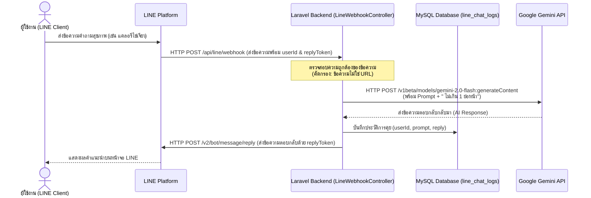

# บทที่ 3: วิธีการดำเนินงานวิจัย (Research Methodology)

ในบทนี้จะอธิบายถึงรายละเอียดการวิเคราะห์ ออกแบบ และพัฒนาระบบให้คำปรึกษากับผู้ควบคุมน้ำหนักร่วมกับเจเนอเรทีฟเอไอ ซึ่งอ้างอิงจากสถาปัตยกรรมซอฟต์แวร์และการเขียนโปรแกรมควบคุมระบบจริงในโครงการ Happy Health 2 โดยมีรายละเอียดโครงสร้างระบบ แผนภาพการไหลของข้อมูล การออกแบบฐานข้อมูล และกลไก Prompt Engineering ดังนี้

---

## 3.1 สถาปัตยกรรมระบบ (System Architecture)

ระบบประกอบด้วย 4 ส่วนสำคัญ ได้แก่:
1. **ส่วนต่อประสานกับผู้ใช้งาน (User Interface)**: แอปพลิเคชัน LINE บนสมาร์ตโฟนของผู้ใช้งาน 
2. **ระบบหลังบ้าน (Backend API Gateway)**: พัฒนาด้วย Laravel 11 ทำหน้าที่รับ Webhook ตรวจสอบความถูกต้อง จัดการข้อมูล จัดเก็บประวัติลงฐานข้อมูล และเรียกใช้บริการภายนอก
3. **ระบบปัญญาประดิษฐ์ (Generative AI Service)**: บริการ Google Gemini API โดยใช้โมเดล `gemini-2.0-flash`
4. **ระบบฐานข้อมูล (Database)**: ฐานข้อมูล MySQL สำหรับเก็บบันทึกประวัติการสนทนาสุขภาพ (Chat Logs)

### แผนภาพความสัมพันธ์และการไหลของข้อมูล (Data Flow Diagram)


---

## 3.2 การออกแบบฐานข้อมูล (Database Design)

เพื่อจัดเก็บและติดตามประวัติการให้คำปรึกษา ระบบได้ออกแบบตารางฐานข้อมูลชื่อ `line_chat_logs` สำหรับบันทึกข้อมูลการโต้ตอบของผู้ใช้งานกับระบบเอไอ โครงสร้างตารางมีรายละเอียดดังต่อไปนี้:

| ฟิลด์ข้อมูล (Field Name) | ประเภทข้อมูล (Data Type) | คุณสมบัติ (Key/Attributes) | คำอธิบาย (Description) |
| :--- | :--- | :--- | :--- |
| `id` | BIGINT | PRIMARY KEY, AUTO_INCREMENT | รหัสระบุรายการบันทึก (Log ID) |
| `line_user_id` | VARCHAR(255) | INDEX | รหัสระบุตัวตนเฉพาะของผู้ใช้งาน LINE (LINE User ID) |
| `prompt` | TEXT | - | ข้อความคำถามหรือข้อสงสัยสุขภาพที่ผู้ใช้งานส่งเข้ามา |
| `reply` | TEXT | - | ข้อความแนะนำและให้คำปรึกษาที่ส่งมาจาก Gemini AI |
| `created_at` | TIMESTAMP | - | วันเวลาที่เกิดกิจกรรมสนทนา |
| `updated_at` | TIMESTAMP | - | วันเวลาที่มีการแก้ไขข้อมูลล่าสุด |

โมเดลที่จัดการข้อมูลตารางนี้ในโค้ดฝั่ง Laravel คือ `App\Models\LineChatLog`

---

## 3.3 การเขียนโปรแกรมและการจัดการระบบ (System Implementation)

การทำงานของระบบถูกกำหนดค่าในส่วนควบคุมของ Laravel API รายละเอียดการเชื่อมโยงระบบประกอบด้วย:

### 3.3.1 การจัดเส้นทาง (Routing)
ในไฟล์ [api.php](file:///e:/chavalit/laravel/happy-health2/routes/api.php) มีการจัดเตรียม 2 เส้นทางหลักที่เกี่ยวข้องกับการประเมินผลและการสนทนา:
* **POST `/api/line/webhook`**: ช่องทางเชื่อมโยงสำหรับรับ Event จากระบบ LINE
* **GET `/api/chatlogs`**: ช่องทางส่งออกข้อมูล Chat logs ล่าสุด 5 รายการให้กับหน้าต่างจัดการข้อมูลหลังบ้าน (Dashboard) โดยมีการกรองสิทธิ์สิทธิผู้ใช้เฉพาะอีเมลแอดมินที่กำหนด (`chavalit.kow@gmail.com`)

### 3.3.2 การประมวลผล Webhook และความปลอดภัยเชิงรับ
เมื่อได้รับ HTTP Request จาก LINE ที่ Controller [LineWebhookController.php](file:///e:/chavalit/laravel/happy-health2/app/Http/Controllers/Api/LineWebhookController.php) ระบบจะดำเนินงานดังนี้:
1. สกัดแยกค่า `replyToken` สำหรับตอบกลับ, `userText` (คำถาม) และ `lineUserId`
2. **การป้องกันลิงก์สแปม (URL Security Filter)**: ระบบมีฟังก์ชันตรวจสอบรูปแบบข้อความ:
   ```php
   private function isUrl($text): bool
   {
       return filter_var($text, FILTER_VALIDATE_URL) !== false;
   }
   ```
   หากพบว่าผู้ใช้ส่งข้อความที่มีโครงสร้างของ URL เข้ามา ระบบจะหยุดประมวลผลทันทีและตอบกลับ HTTP 200 `OK URL` โดยไม่ทำการส่งข้อมูลไปยัง Gemini API เพื่อป้องกันบอตสแปม หรือการพยายามเจาะระบบผ่านการใช้ URL หลอกลวง

### 3.3.3 เทคนิคการปรับแต่งคำสั่ง (Prompt Engineering)
ในการควบคุมคุณภาพและความยาวคำตอบของปัญญาประดิษฐ์ ระบบจะรับข้อมูลดิบจากผู้ใช้มาประกอบเข้ากับคำสั่งจำกัดพฤติกรรมก่อนนำไปเรียกใช้ Gemini API โดยเชื่อมต่อผ่าน HTTP Client ของ Laravel ไปยัง API Endpoint ของกูเกิลด้วยพารามิเตอร์โมเดล `gemini-2.0-flash`
```php
private function callGemini(string $prompt): string
{
    $apiKey = env('GEMINI_API_KEY');
    $modelName = "gemini-2.0-flash";
    $response = Http::withHeaders([
        'Content-Type' => 'application/json',
    ])->post("https://generativelanguage.googleapis.com/v1beta/models/{$modelName}:generateContent?key={$apiKey}", [
        'contents' => [[
            'parts' => [['text' => "{$prompt} ไม่เกิน 1 ย่อหน้า"]]
        ]]
    ]);

    return $response->json('candidates.0.content.parts.0.text') ?? 'ขออภัย ระบบไม่สามารถตอบได้';
}
```
การต่อสร้อยท้ายคำสั่งด้วยคำว่า **" ไม่เกิน 1 ย่อหน้า"** มีจุดประสงค์เพื่อลดการคำนวณโทเคนส่วนเกิน (Token consumption) ป้องกันคำอธิบายที่เยิ่นเย้อ และช่วยให้การนำเสนอบนอุปกรณ์พกพาสามารถอ่านจบได้ในหน้าจอเดียว

---

## 3.4 การทดสอบและเกณฑ์ประเมินผล

สำหรับการวิจัยนี้ ได้วางแนวทางการทดสอบออกเป็น 3 ขั้นตอน:
1. **การทดสอบความเสถียรของช่องทางการสื่อสาร (API Integration Testing)**: ตรวจสอบความถูกต้องของการรับ-ส่ง Webhook จากระบบ LINE และการเชื่อมโยง API ของ Google Gemini ว่าทำงานลุล่วงได้ภายใน 3-5 วินาที
2. **การประเมินความสอดคล้องเชิงเนื้อหา (Prompt Relevance Testing)**: ทดสอบด้วยคำถามทั่วไปเกี่ยวกับการควบคุมน้ำหนัก คำถามเกี่ยวกับโภชนาการ และการวิเคราะห์คำตอบจากโมเดลเอไอว่ามีการตอบกลับเกิน 1 ย่อหน้าหรือไม่
3. **การประมวลสถิติและประวัติ (Audit Logging)**: ตรวจสอบความถูกต้องของการบันทึกค่าลงในตาราง `line_chat_logs` เพื่อให้มั่นใจได้ว่าประวัติการสนทนาของระบบจะสามารถตรวจสอบย้อนหลังได้จริง
