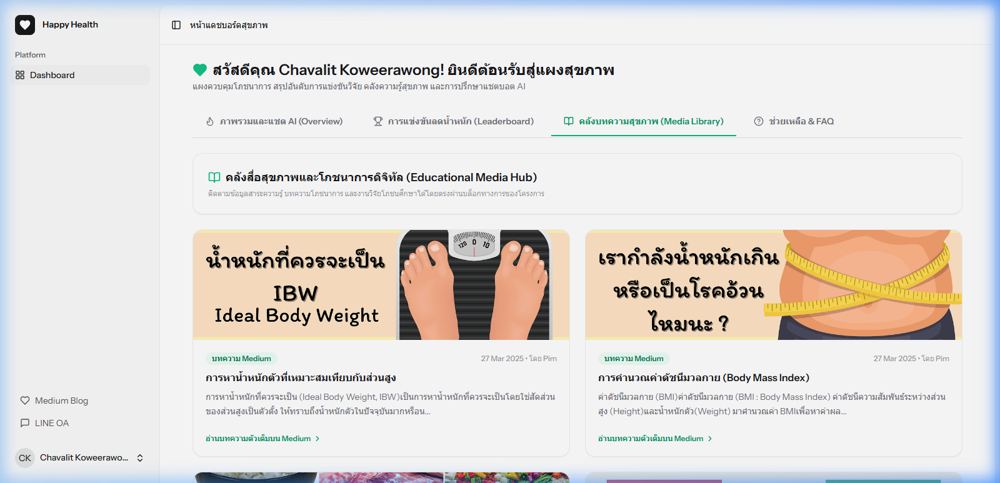

# 4.3 ผลการอบรม สนับสนุนความรู้ และแนะแนวโภชนาการเฉพาะบุคคล (สอดคล้องกับวัตถุประสงค์ข้อที่ 1.2.3)

คณะผู้วิจัยจัดกิจกรรมถ่ายทอดเทคโนโลยีและการอบรมสอนขั้นตอนใช้งานแพลตฟอร์มร่วมกับความรู้ด้านโภชนาการแก่กลุ่มตัวอย่างบุคลากรในมหาวิทยาลัย ผลการประเมินความคิดเห็นและความพึงพอใจของกลุ่มตัวอย่างจำนวน 30 ราย แสดงผลลัพธ์ผ่านเกณฑ์คะแนนเฉลี่ยจำแนกตามประเด็นต่าง ๆ ดังนี้:

1) **ความพึงพอใจต่อระบบแอปพลิเคชันและการแนะแนวสุขภาพ** อยู่ในเกณฑ์ **มากที่สุด** ($\bar{x} = 4.59$, S.D. = 0.49) โดยกลุ่มตัวอย่างเห็นว่าระบบแชตบอตแนะนำอาหารและวิเคราะห์แคลอรีมีความสะดวกและใช้งานง่ายมากผ่านหน้าต่างแชต LINE OA ($\bar{x} = 4.73$, S.D. = 0.45) และความถูกต้องและความสอดคล้องของสาระความรู้โภชนาการและการคำนวณแคลอรีอยู่ในเกณฑ์ดีเยี่ยม ($\bar{x} = 4.47$, S.D. = 0.51)
2) **ความพึงพอใจต่อการจัดกิจกรรมอบรมถ่ายทอดเทคโนโลยี** อยู่ในเกณฑ์ **มากที่สุด** ($\bar{x} = 4.62$, S.D. = 0.50) โดยความชัดเจนของคู่มือ แผนภาพสรุป และกระบวนการสาธิตแนะนำจากทีมวิจัยอยู่ในเกณฑ์มาก ($\bar{x} = 4.50$, S.D. = 0.57) และกลุ่มตัวอย่างเห็นพ้องว่าระบบสามารถอำนวยประโยชน์ในการนำความรู้โภชนาการไปปรับประยุกต์ใช้ในการใช้ชีวิตประจำวันได้จริงในระดับดีเลิศ ($\bar{x} = 4.67$, S.D. = 0.48)

---

## 4.3.1 รายละเอียดขั้นตอนการจัดกิจกรรมถ่ายทอดเทคโนโลยี

ในการจัดกิจกรรมถ่ายทอดนวัตกรรม คณะผู้วิจัยได้ดำเนินการจัดอบรมเชิงปฏิบัติการ (Workshop) โดยแบ่งเนื้อหาหลักออกเป็น 4 ขั้นตอน ดังนี้:
1) **การบรรยายพื้นฐานสุขอนามัยและโภชนาการ**: ให้ความรู้เรื่องการคำนวณพลังงานที่ร่างกายต้องการในระดับรายวันตามค่าอัตราการเผาผลาญพื้นฐาน (BMR) และการจำกัดแคลอรี่เพื่อลดน้ำหนักอย่างปลอดภัย (Caloric Deficit)
2) **การสาธิตและแจกจ่ายเอกสารคู่มือการใช้งาน**: ทีมวิจัยทำการสาธิตระบบและแจกคู่มือผู้ใช้ 2 ส่วน ได้แก่ [คู่มือการใช้งานแชตบอต LINE OA](file:///d:/laravel/happy-health2/docs/line_manual.md) และ [คู่มือการใช้งานระบบเว็บไซต์](file:///d:/laravel/happy-health2/docs/website_manual.md) แก่ผู้เข้าร่วมเพื่อใช้อ้างอิงระหว่างทดลอง
3) **การทดลองใช้งานและผูกบัญชีเฉพาะบุคคล**: กลุ่มตัวอย่างทำการสแกน QR Code เพื่อแอดไลน์บอตไอดี `@203glfet` และทำการลงทะเบียนข้อมูลสรีระร่างกาย (น้ำหนัก ส่วนสูง อายุ เพศ และระดับกิจกรรม) บนหน้าเว็บของโครงการเพื่อให้ระบบแชตบอตสามารถคำนวณเป้าหมายรายบุคคลได้อย่างถูกต้อง
4) **การเผยแพร่บทความความรู้ผ่านบล็อกสาธารณะ (Medium publication)**: คณะผู้วิจัยได้จัดทำการเรียบเรียงข้อมูลความรู้สุขภาพ โภชนาการ และการแนะแนวลดน้ำหนัก เขียนเผยแพร่ลงบนเว็บไซต์บล็อกที่เป็นทางการของโครงการที่ลิงก์ [https://medium.com/happy-health-happy-heart](https://medium.com/happy-heart-happy-heart) เพื่อใช้เป็นแหล่งเรียนรู้เสริมสำหรับผู้เข้าร่วมโครงการและประชาชนทั่วไปที่สนใจศึกษาค้นคว้าย้อนหลังได้ทุกเวลา

---

## 4.3.2 การอภิปรายผลการวิจัย (Discussion)

### อิทธิพลของการจัดอบรมและคู่มือแนะนำการใช้งานต่อการยอมรับนวัตกรรมสุขภาพ
ผลสัมฤทธิ์ของคะแนนความพึงพอใจต่อการจัดอบรมและคู่มือที่อยู่ในเกณฑ์มากที่สุด ชี้ชัดว่า กระบวนการถ่ายทอดความรู้เชิงเทคนิคที่มีความชัดเจนสามารถลดแรงเสียดทานในการใช้งานระบบใหม่ได้อย่างมีนัยสำคัญ เมื่ออภิปรายผ่าน **ทฤษฎีการยอมรับเทคโนโลยี (Technology Acceptance Model: TAM)** ของ **Davis (1989)** พบว่า:
1) **การรับรู้ถึงความง่ายในการใช้งาน (Perceived Ease of Use)**: การเลือกช่องทางประยุกต์ใช้เทคโนโลยีแชตบอตบน LINE Platform ที่ผู้ใช้งานคุ้นเคยในชีวิตประจำวัน ผสานกับการมีคู่มือสรุปขั้นตอนและแผนภาพการทำงานที่ชัดเจน ($\bar{x} = 4.50$, S.D. = 0.57) ช่วยลดระดับความยากในการเรียนรู้เชิงเทคนิค ส่งผลให้กลุ่มตัวอย่างมีทัศนคติที่ดีและรับรู้ว่าระบบใช้งานได้สะดวก
2) **การรับรู้ประโยชน์ใช้สอย (Perceived Usefulness)**: การสนับสนุนข้อมูลโภชนาการเฉพาะบุคคลผูกโยงตามประวัติร่างกายจริง ส่งผลให้ผู้ใช้มองเห็นความคุ้มค่าและประโยชน์ใช้สอยที่เป็นรูปธรรม นำไปสู่ความตั้งใจในการนำนวัตกรรมนี้ไปปรับพฤติกรรมการบริโภคจริงในชีวิตประจำวันในระดับดีเลิศ ($\bar{x} = 4.67$, S.D. = 0.48)
