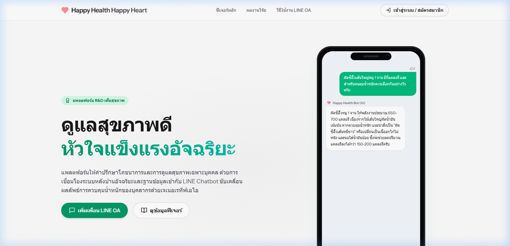
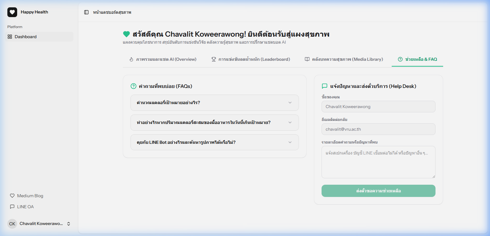

# 4.4 ผลการจัดการแข่งขันการลดน้ำหนักและการวิเคราะห์ผลลัพธ์สุขภาพเชิงตัวเลข (สอดคล้องกับวัตถุประสงค์ข้อที่ 1.2.4)

ที่อยู่เว็บไซต์อย่างเป็นทางการของโครงการ: **[https://happyhealthhappyheart.com](https://happyhealthhappyheart.com)**

ทีมวิจัยจัดโครงการแข่งขันควบคุมน้ำหนักในกลุ่มตัวอย่างบุคลากรในมหาวิทยาลัยเป็นเวลา 8 สัปดาห์ โดยนำกลไกการส่งข้อมูลแนะนำการควบคุมอาหารร้อยละ 80 ควบคู่ไปกับเนื้อหาโปรแกรมออกกำลังกายร้อยละ 20 ผ่านระบบแจ้งเตือนเชิงรุกอัตโนมัติและแชตบอต Generative AI (Google Gemini 3.6 Flash) ร่วมกับการวัดผลเชิงการแพทย์ในกลุ่มตัวอย่างจำนวน 38 ราย ดังนี้:

---

## 4.4.1 ข้อมูลทั่วไปของกลุ่มตัวอย่างที่เข้าร่วมโปรแกรมแข่งขันการลดน้ำหนัก (n = 38)

จากการศึกษาข้อมูลลักษณะทางประชากรของกลุ่มตัวอย่างบุคลากรมหาวิทยาลัยที่เข้าร่วมโปรแกรมแข่งขันการลดน้ำหนักและทดลองใช้ระบบจำนวน 38 ราย พบว่า กลุ่มตัวอย่างส่วนใหญ่เป็นเพศหญิงจำนวน 25 ราย คิดเป็นร้อยละ 65.8 และเพศชายจำนวน 13 ราย คิดเป็นร้อยละ 34.2 มีช่วงอายุเฉลี่ยเท่ากับ 40.16 ± 8.90 ปี (จำแนกเป็นผู้มีอายุน้อยกว่า 40 ปี จำนวน 21 ราย คิดเป็นร้อยละ 55.3, อายุระหว่าง 41-50 ปี จำนวน 11 ราย คิดเป็นร้อยละ 28.9, และอายุ 51 ปีขึ้นไป จำนวน 6 ราย คิดเป็นร้อยละ 15.8) 

ด้านระดับการศึกษา พบว่ากลุ่มตัวอย่างสำเร็จการศึกษาสูงกว่าระดับปริญญาตรีจำนวน 22 ราย คิดเป็นร้อยละ 57.9 และระดับปริญญาตรีจำนวน 16 ราย คิดเป็นร้อยละ 42.1 จำแนกตามสายอาชีพเป็นบุคลากรฝ่ายสนับสนุนจำนวน 20 ราย คิดเป็นร้อยละ 52.6 และบุคลากรฝ่ายวิชาการจำนวน 18 ราย คิดเป็นร้อยละ 47.4 โดยกลุ่มตัวอย่างส่วนใหญ่เป็นผู้ไม่มีโรคประจำตัวจำนวน 31 ราย คิดเป็นร้อยละ 81.6 ดังรายละเอียดในตารางที่ 4.1

### ตารางที่ 4.1 จำนวนและร้อยละข้อมูลทั่วไปของกลุ่มตัวอย่างที่เข้าร่วมโปรแกรมแข่งขันการลดน้ำหนัก (n = 38)

| ข้อมูลทั่วไป | จำนวน (คน) | ร้อยละ |
| :--- | :---: | :---: |
| **เพศ** | | |
| ชาย | 13 | 34.2 |
| หญิง | 25 | 65.8 |
| **อายุ (ปี)** | | |
| น้อยกว่า 40 ปี | 21 | 55.3 |
| 41–50 ปี | 11 | 28.9 |
| 51 ปีขึ้นไป | 6 | 15.8 |
| *(ค่าเฉลี่ย 40.16 ปี, S.D. 8.90 ปี, Min 27 ปี, Max 65 ปี)* | | |
| **ระดับการศึกษา** | | |
| ปริญญาตรี | 16 | 42.1 |
| สูงกว่าปริญญาตรี | 22 | 57.9 |
| **อาชีพ** | | |
| บุคลากรฝ่ายวิชาการ | 18 | 47.4 |
| บุคลากรฝ่ายสนับสนุน | 20 | 52.6 |
| **โรคประจำตัว** | | |
| ไม่มีโรคประจำตัว | 31 | 81.6 |
| มีโรคประจำตัว | 7 | 18.4 |

---

## 4.4.2 การเปรียบเทียบผลการวิเคราะห์องค์ประกอบร่างกาย ก่อนและหลังเข้าร่วมโปรแกรม (n = 38)

ผลการเปรียบเทียบองค์ประกอบร่างกายของกลุ่มตัวอย่าง ก่อนและหลังเข้าร่วมโปรแกรมส่งเสริมสุขภาพโดยประยุกต์ใช้เทคโนโลยีเจเนอเรทีฟเอไอ พบว่า ภายหลังเข้าร่วมโปรแกรม กลุ่มตัวอย่างมีองค์ประกอบร่างกายดีขึ้นอย่างมีนัยสำคัญทางสถิติในทุกตัวแปร ได้แก่:

1) **น้ำหนักตัว (Kg)**: ค่าเฉลี่ยน้ำหนักตัวลดลงจาก 70.46 ± 20.28 กิโลกรัม ก่อนการทดลอง เหลือ 68.77 ± 19.46 กิโลกรัม หลังการทดลอง โดยมีผลต่างค่าเฉลี่ยลดลง 1.69 กิโลกรัม (95% CI: 1.02 ถึง 2.19, t = 6.92, p-value < .001)

2) **ค่าดัชนีมวลกาย (BMI)**: ค่าเฉลี่ยดัชนีมวลกายลดลงจาก 24.84 ± 3.60 kg/m² ก่อนการทดลอง เหลือ 24.21 ± 3.30 kg/m² หลังการทดลอง โดยมีผลต่างค่าเฉลี่ยลดลง 0.63 kg/m² (95% CI: 0.41 ถึง 0.85, t = 5.96, p-value < .001)

3) **เปอร์เซ็นต์ไขมันในร่างกาย (% Body Fat)**: ค่าเฉลี่ยเปอร์เซ็นต์ไขมันลดลงจากร้อยละ 31.59 ± 7.70 ก่อนการทดลอง เหลือร้อยละ 30.11 ± 7.68 หลังการทดลอง โดยมีผลต่างค่าเฉลี่ยลดลงร้อยละ 1.36 (95% CI: 1.02 ถึง 1.92, t = 6.67, p-value < .001)

4) **มวลกล้ามเนื้อ (Muscle Mass)**: ค่าเฉลี่ยของมวลกล้ามเนื้อเพิ่มขึ้นจาก 26.52 ± 6.77 กิโลกรัม ก่อนการทดลอง เป็น 27.22 ± 6.88 กิโลกรัม หลังการทดลอง โดยมีผลต่างค่าเฉลี่ยเพิ่มขึ้น 0.70 กิโลกรัม (95% CI: -1.25 ถึง -0.13, t = -2.51, p-value = .017) ดังแสดงในตารางที่ 4.2

### ตารางที่ 4.2 ผลการเปรียบเทียบองค์ประกอบร่างกาย ก่อนและหลังเข้าร่วมโปรแกรมส่งเสริมสุขภาพ (n = 38)

| ตัวแปร | ก่อนเข้าร่วม (Mean ± SD) | หลังเข้าร่วม (Mean ± SD) | Mean Difference | 95% CI | t | p-value |
| :--- | :---: | :---: | :---: | :---: | :---: | :---: |
| น้ำหนักตัว (Kg) | 70.46 ± 20.28 | 68.77 ± 19.46 | 1.69 | 1.02 to 2.19 | 6.92 | <.001 |
| ดัชนีมวลกาย (BMI) | 24.84 ± 3.60 | 24.21 ± 3.30 | 0.63 | 0.41 to 0.85 | 5.96 | <.001 |
| เปอร์เซ็นต์ไขมันในร่างกาย (%) | 31.59 ± 7.70 | 30.11 ± 7.68 | 1.36 | 1.02 to 1.92 | 6.67 | <.001 |
| มวลกล้ามเนื้อ (Kg) | 26.52 ± 6.77 | 27.22 ± 6.88 | -0.70 | -1.25 to -0.13 | -2.51 | .017 |

---

## 4.4.3 การเปรียบเทียบค่าคะแนนเฉลี่ยความรู้และพฤติกรรมสุขภาพ (3 อ.) ก่อนและหลังเข้าร่วมโปรแกรม (n = 38)

ผลการเปรียบเทียบค่าคะแนนเฉลี่ยความรู้เกี่ยวกับหลัก 3 อ. (อาหาร ออกกำลังกาย อารมณ์) และพฤติกรรมสุขภาพการดูแลตนเอง พบว่า ภายหลังเข้าร่วมโปรแกรมส่งเสริมสุขภาพโดยประยุกต์ใช้เทคโนโลยีเจเนอเรทีฟเอไอ กลุ่มตัวอย่างมีระดับความรู้และพฤติกรรมสุขภาพเพิ่มขึ้นอย่างมีนัยสำคัญทางสถิติ ดังนี้:

1) **ความรู้เกี่ยวกับหลัก 3 อ. (อาหาร ออกกำลังกาย อารมณ์)**: ค่าเฉลี่ยคะแนนความรู้เพิ่มขึ้นจาก 11.26 ± 2.06 คะแนน ก่อนการทดลอง เป็น 13.45 ± 1.42 คะแนน หลังการทดลอง (Mean Difference = -2.18, 95% CI: -2.69 ถึง -1.67, t = -8.64, p-value < .001)

2) **พฤติกรรมสุขภาพการดูแลตนเองโดยภาพรวม**: ค่าเฉลี่ยพฤติกรรมสุขภาพรวมเพิ่มขึ้นจาก 1.66 ± 0.42 คะแนน ก่อนการทดลอง เป็น 2.36 ± 0.17 คะแนน หลังการทดลอง (Mean Difference = -0.70, 95% CI: -0.86 ถึง -0.53, t = -8.74, p-value < .001)

เมื่อพิจารณาจำแนกเป็นรายด้านของพฤติกรรมสุขภาพ พบว่าเพิ่มขึ้นอย่างมีนัยสำคัญทางสถิติทั้ง 3 ด้าน ได้แก่:
1) **พฤติกรรมการบริโภคอาหาร**: เพิ่มขึ้นจาก 1.78 ± 0.30 เป็น 2.35 ± 0.26 (Mean Difference = -0.56, 95% CI: -0.70 ถึง -0.42, t = -7.97, p-value < .001)
2) **พฤติกรรมการออกกำลังกาย**: เพิ่มขึ้นจาก 1.65 ± 0.49 เป็น 2.38 ± 0.26 (Mean Difference = -0.73, 95% CI: -0.93 ถึง -0.53, t = -7.47, p-value < .001)
3) **พฤติกรรมการจัดการความเครียด**: เพิ่มขึ้นจาก 1.64 ± 0.73 เป็น 2.36 ± 0.31 (Mean Difference = -0.71, 95% CI: -0.98 ถึง -0.44, t = -5.33, p-value < .001) ดังแสดงในตารางที่ 4.3

### ตารางที่ 4.3 ผลการเปรียบเทียบค่าคะแนนเฉลี่ยความรู้และพฤติกรรมสุขภาพ ก่อนและหลังเข้าร่วมโปรแกรม (n = 38)

| ตัวแปรวัดผล | ก่อนเข้าร่วม (Mean ± SD) | หลังเข้าร่วม (Mean ± SD) | Mean Difference | 95% CI | t | p-value |
| :--- | :---: | :---: | :---: | :---: | :---: | :---: |
| **ความรู้เกี่ยวกับหลัก 3 อ. (อาหาร ออกกำลังกาย อารมณ์)** | 11.26 ± 2.06 | 13.45 ± 1.42 | -2.18 | -2.69 to -1.67 | -8.64 | <.001 |
| **พฤติกรรมสุขภาพการดูแลตนเอง** | | | | | | |
| 1) พฤติกรรมการบริโภคอาหาร | 1.78 ± 0.30 | 2.35 ± 0.26 | -0.56 | -0.70 to -0.42 | -7.97 | <.001 |
| 2) พฤติกรรมการออกกำลังกาย | 1.65 ± 0.49 | 2.38 ± 0.26 | -0.73 | -0.93 to -0.53 | -7.47 | <.001 |
| 3) พฤติกรรมการจัดการความเครียด | 1.64 ± 0.73 | 2.36 ± 0.31 | -0.71 | -0.98 to -0.44 | -5.33 | <.001 |
| **ภาพรวมพฤติกรรมสุขภาพ** | **1.66 ± 0.42** | **2.36 ± 0.17** | **-0.70** | **-0.86 to -0.53** | **-8.74** | **<.001** |

---

## 4.4.4 ภาพถ่ายหน้าต่างระบบและการสนับสนุนทางเทคนิค

### 1) หน้าแรกแพลตฟอร์มและการประชาสัมพันธ์โครงการ (Home Landing Page)

### 2) ระบบช่วยเหลือและตอบคำถามพบบ่อย (Helpdesk & FAQ)

---

## 4.4.5 การอภิปรายผลการวิจัย (Discussion)

### 1) ความสม่ำเสมอในการปรับพฤติกรรมจากการกระตุ้นผ่านระบบแจ้งเตือนเชิงรุก
ผลลัพธ์การลดน้ำหนักเฉลี่ย 1.69 กิโลกรัมและการรักษาระเบียบบันทึกประวัติตนเองในอัตราสูง อภิปรายผลได้ว่า ระบบแจ้งเตือนข้อมูลโภชนาการและการออกกำลังกายอัตโนมัติ ทำหน้าที่เป็นสื่อกระตุ้นเชิงบวกเพื่อรักษาความจำในวิถีชีวิตอันเร่งรีบของกลุ่มตัวอย่างคนทำงานมหาวิทยาลัย สอดรับกับงานวิจัยของ **จุฬาวรรณ วิสภา, วันธณี วิรุฬห์พานิช, และพิสมัย วัฒนสิทธิ์ (2563)** ที่ระบุว่าการใช้ระบบติดตามโภชนาการบนมือถือร่วมกับฟังก์ชันการส่งการแจ้งเตือนอัตโนมัติ (Push Notifications) ช่วยปรับพฤติกรรมการเลือกกินอาหารที่ดีต่อสุขภาพและส่งผลต่อการลดน้ำหนักตัวรวมถึงดัชนีมวลกายได้อย่างยั่งยืน

### 2) อิทธิพลทางสังคมและกลุ่มสัมพันธ์ในการควบคุมน้ำหนัก
ความพึงพอใจในระดับสูงยิ่งของกลุ่มตัวอย่างต่อกิจกรรมการแข่งขันควบคุมน้ำหนัก ชี้ชัดว่า การกระตุ้นพฤติกรรมสุขภาพจำต้องอาศัยกลไกทางสังคมควบคู่กับตัวระบบ อภิปรายได้ว่า กิจกรรมการแข่งขันควบคุมน้ำหนักร่วมกับการให้รางวัลสะสมแต้มตามทฤษฎีเกมมิฟิเคชัน ช่วยดึงดูดใจและกระตุ้นแรงขับภายนอกร่วมกับแรงสนับสนุนจากกลุ่มเพื่อนร่วมงานในองค์กร ส่งผลให้เกิดพฤติกรรมการดูแลสุขภาพอย่างสม่ำเสมอ สอดรับกับผลงานวิจัยของ **Leahey, Kumar, Weinberg, and Wing (2012)** ที่ชี้ชัดว่าการแข่งขันลดน้ำหนักระดับกลุ่มจะเหนี่ยวนำอิทธิพลทางสังคมเชิงบวก (Social Influence) และกระตุ้นให้ผู้ร่วมแข่งขันสามารถทำตามแผนโภชนาการและบรรลุผลลัพธ์ลดน้ำหนักได้มีนัยสำคัญมากกว่าการควบคุมน้ำหนักเพียงคนเดียว
