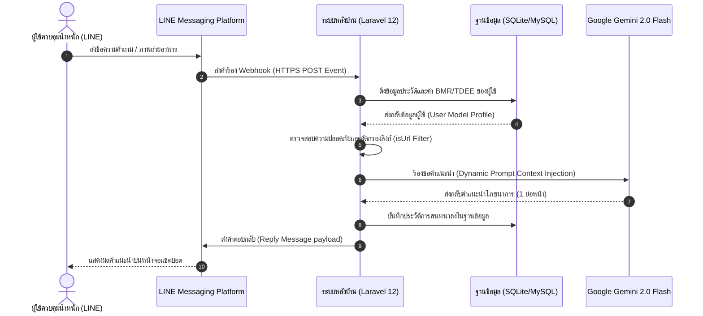

# เอกสารผลลัพธ์กิจกรรมที่ 4: การออกแบบและพัฒนาแพลตฟอร์มออนไลน์และสถาปัตยกรรมระบบ
## (Activity 4 Output: Online Platform Architecture and Software Development Manual)

---

## 1. แผนผังสถาปัตยกรรมระบบและเทคโนโลยีหลัก (System Architecture and Technical Stack)

แพลตฟอร์ม Happy Health ได้รับการออกแบบตามสถาปัตยกรรมโมเดลและบริการแบบกระจายศูนย์ (Service-Oriented Architecture) เพื่อเชื่อมโยงอินเทอร์เฟซผู้ใช้งานบนสมาร์ทโฟนเข้ากับระบบประมวลผลหลังบ้านอย่างราบรื่นและรวดเร็ว

### 1.1 สถาปัตยกรรมการไหลของข้อมูล (System Data Flow Diagram)



### 1.2 เทคโนโลยีหลักที่ใช้ในการพัฒนาแพลตฟอร์ม
1. **ระบบบริการหลังบ้าน (Backend Framework)**: Laravel 12.x ทำหน้าที่เป็น Core Webhook Handler บริหารจัดการสิทธิ์การเข้าใช้งานระบบ การจัดการฐานข้อมูล และจัดเก็บข้อมูล Log
2. **ระบบการติดต่อผู้ใช้ (Frontend Engine)**: React.js ร่วมกับ Inertia.js และ TypeScript สำหรับทำหน้าที่แสดงผลแผงควบคุมระบบ (Admin Dashboard) เพื่อแสดงสถิติข้อมูลสุขภาพและการเปลี่ยนแปลงน้ำหนักตัว
3. **ฐานข้อมูลระบบ (Database Management)**: SQLite (สำหรับระบบทดสอบเบื้องต้น) และ MySQL (สำหรับระบบใช้งานจริง) ใช้เก็บตารางประวัติผู้ใช้งาน ตารางบันทึกการคุย และตารางการประเมินสุขภาพ
4. **ส่วนเชื่อมประสานภายนอก (API Integrations)**: LINE Messaging API SDK สำหรับการส่งข้อความเข้าและออก และ Google Gemini API (โมเดล `gemini-3.6-flash`) สำหรับการใช้ความสามารถของปัญญาประดิษฐ์ประมวลผลเชิงสร้างสรรค์

---

## 2. รายละเอียดสเปกของโมดูลฟังก์ชันหลัก (Core System Modules)

แพลตฟอร์มออนไลน์ได้รับการพัฒนาขึ้นโดยรวมชุดเครื่องมือช่วยดูแลสุขภาพ 4 ฟังก์ชันย่อยเข้าไว้ด้วยกันอย่างเป็นเอกภาพ

### 2.1 ตารางสรุปฟังก์ชันระบบหลัก (Core Platform Functions Table)

| ชื่อระบบย่อย (Subsystem) | หน้าที่หลักและการประมวลผล | อินเทอร์เฟซผู้ใช้งานหลัก |
| :--- | :--- | :--- |
| 1. ระบบให้คำปรึกษาโดย AI | รับข้อความ/รูปภาพอาหารจากผู้ใช้ วิเคราะห์สัดส่วนแคลอรี และตอบกลับผ่าน AI | LINE Chat Interface (แชตบอต) |
| 2. ระบบบันทึกและติดตามข้อมูลสุขภาพ | คำนวณค่าดัชนีมวลกาย (BMI) ค่า BMR/TDEE บันทึกประวัติน้ำหนักรายสัปดาห์ | LINE Rich Menu และ Webview Form |
| 3. ระบบแผงควบคุมและแจ้งเตือน | สรุปผลภาพรวมข้อมูลรายบุคคล แจ้งเตือนน้ำหนัก และแจ้งรายงานสรุปสุขภาพ | Admin Dashboard (React Web App) |
| 4. ระบบสกัดกั้นความปลอดภัย | ตรวจหา URL แปลกปลอม กรองโค้ดอันตราย สกรีนคำถามที่ไม่เหมาะสมทางการแพทย์ | เบื้องหลังของระบบประมวลผล (Backend) |

---

## 3. โครงสร้างซอร์สโค้ดและเส้นทางจัดการคำร้อง (Code Directory and Routing)

ซอร์สโค้ดทั้งหมดได้รับการพัฒนาภายใต้กรอบโครงสร้าง Model-View-Controller (MVC) ของ Laravel 12.x โดยแยกส่วนการประมวลผลที่เป็นส่วนตัวและปลอดภัย

### 3.1 โครงสร้างไฟล์ซอร์สโค้ดหลัก (Key Directory Structure)
```text
happy-health2/
├── app/
│   ├── Http/
│   │   ├── Controllers/
│   │   │   ├── LineWebhookController.php   <-- จัดการการทำงานของแชตบอตหลัก
│   │   │   ├── AdminDashboardController.php <-- จัดการข้อมูลสถิติของแผงควบคุม
│   │   │   └── HealthLogController.php      <-- จัดการบันทึกสุขภาพน้ำหนักตัว
│   │   └── Middleware/
│   │       └── VerifyLineSignature.php      <-- ตรวจสอบความถูกต้องของสิทธิ์เข้าใช้ API
│   └── Models/
│       ├── User.php                         <-- โมเดลข้อมูลผู้ใช้และการเชื่อมโยง LINE ID
│       ├── LineChatLog.php                  <-- โมเดลเก็บประวัติคำถามคำตอบ
│       └── HealthProfile.php                <-- โมเดลสัดส่วน BMR/TDEE/น้ำหนัก
```

### 3.2 ตารางระบุเส้นทางการควบคุม (Routing Specifications Table)

| วิธีการส่ง (Method) | เส้นทาง (URI Path) | ผู้ประมวลผล (Controller Action) | หน้าที่หลัก |
| :--- | :--- | :--- | :--- |
| POST | `/api/line/webhook` | `LineWebhookController@handle` | รับคำร้องอีเวนต์จาก LINE API และตอบกลับผ่าน AI |
| GET | `/admin/dashboard` | `AdminDashboardController@index` | แสดงแผงควบคุมวิเคราะห์ข้อมูลผู้ใช้งานและกราฟสุขภาพ |
| POST | `/api/health-log/store` | `HealthLogController@store` | บันทึกข้อมูลน้ำหนักตัวและคำนวณ BMI รายสัปดาห์ |

---

## 4. คู่มือการทดสอบระบบและการติดตั้ง (System Setup and Testing Manual)

การนำระบบไปติดตั้งในเครื่องเซิร์ฟเวอร์หรือทดสอบใช้งานภายในเครื่องคอมพิวเตอร์ส่วนบุคคล มีขั้นตอนสำคัญตามลำดับดังต่อไปนี้

### 4.1 ขั้นตอนการติดตั้งสภาพแวดล้อม (System Setup Steps)
1. **การดาวน์โหลดซอร์สโค้ด**: โคลนโค้ดโครงการจาก Git Repository มายังโฟลเดอร์ทำงาน
2. **การตั้งค่าไฟล์สภาพแวดล้อม**: คัดลอกไฟล์ `.env.example` เป็น `.env` และกำหนดค่าการเชื่อมโยงระบบ ประกอบด้วย รหัสผ่านฐานข้อมูล, ค่า `LINE_CHANNEL_ACCESS_TOKEN`, `LINE_CHANNEL_SECRET` และรหัส `GEMINI_API_KEY`
3. **การดาวน์โหลดแพ็กเกจพึ่งพา**: รันคำสั่ง `composer install` เพื่อดาวน์โหลดไลบรารีของ PHP Laravel และรันคำสั่ง `npm install && npm run build` เพื่อประกอบคอมโพเนนต์ React Dashboard
4. **การเตรียมฐานข้อมูล**: รันคำสั่ง `php artisan migrate --seed` เพื่อสร้างโครงสร้างตารางและใส่ข้อมูลตัวอย่างระบบ
5. **การจำลองอุโมงค์สัญญาณ**: รันคำสั่ง `ngrok http 8000` เพื่อรับ HTTPS URL จากภายนอก นำไปตั้งค่าเป็น Webhook URL ในระบบ LINE Developers Console

### 4.2 การทดสอบการทำงานของฟังก์ชันหลัก (Functionality Testing)
1. **การรับรอง Webhook**: กดปุ่ม Verify ในเมนู Webhook ของ LINE Developers เพื่อให้ระบบตรวจสอบลายเซ็นดิจิทัล (Signature Verification) ผ่านด่านป้องกันของ Laravel
2. **การพิมพ์ข้อความทั่วไป**: พิมพ์คำถามเกี่ยวกับเมนูอาหาร เช่น "ผัดไทย 1 จาน กี่แคลอรี" บอตจะต้องตอบกลับคำแนะนำทางโภชนาการภายใน 3 วินาที
3. **การทดสอบความปลอดภัย**: พิมพ์ข้อความที่มีลิงก์เว็บภายนอก เช่น "เข้าไปที่เว็บ http://test.com" ตัวกรองจะต้องบล็อกข้อมูลทันทีและส่งข้อความเตือนความปลอดภัยกลับหาผู้ใช้

---
