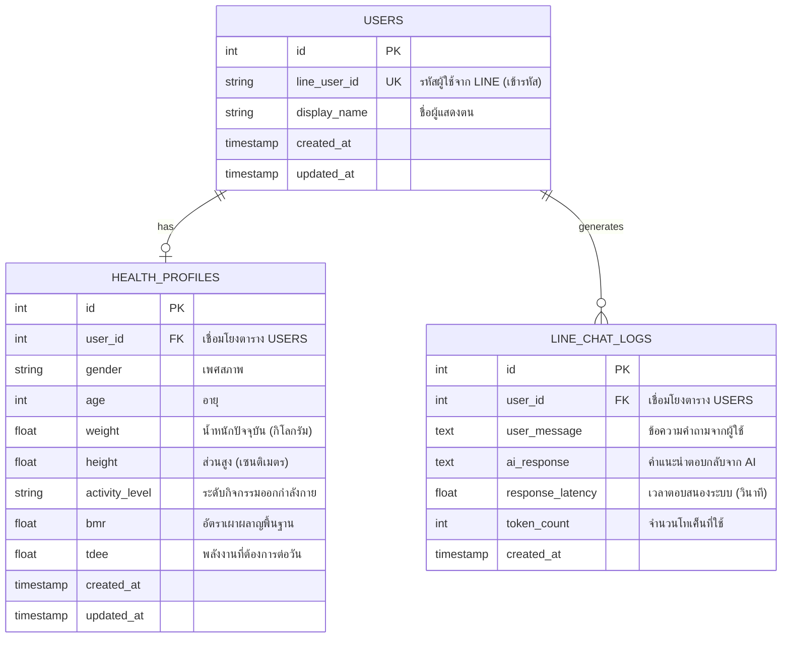

# เอกสารผลลัพธ์กิจกรรมที่ 5: การจัดทำฐานข้อมูลที่มีความปลอดภัยและการคุ้มครองข้อมูลส่วนบุคคล
## (Activity 5 Output: Secure Database Schema and Personal Data Protection Report)

---

## 1. แผนภาพโครงสร้างฐานข้อมูลและตารางข้อมูล (Database Schema and ER Diagram)

การออกแบบระบบจัดการฐานข้อมูล (Database Management System) ของแพลตฟอร์ม Happy Health พัฒนาขึ้นโดยคำนึงถึงความถูกต้องของความสัมพันธ์ของข้อมูล และการจัดระเบียบตารางเพื่อความปลอดภัยและประสิทธิภาพการค้นหาข้อมูล

### 1.1 แผนภาพโครงสร้างความสัมพันธ์ของข้อมูล (Entity-Relationship Diagram)

### 1.2 รายละเอียดโครงสร้างฟิลด์ตารางข้อมูล (Database Table Specifications)

#### ตาราง USERS (เก็บข้อมูลบัญชีผู้ใช้งาน)
1. `id` (Integer, Primary Key): รหัสอ้างอิงภายในระบบหลังบ้านแบบเพิ่มค่าอัตโนมัติ
2. `line_user_id` (Varchar 255, Unique): รหัสประจำตัวเฉพาะจาก LINE Platform (เข้ารหัสแบบแฮชทางเดียวเพื่อความปลอดภัย)
3. `display_name` (Varchar 255): ชื่อที่ผู้ใช้ใช้แสดงในแอปพลิเคชัน LINE

#### ตาราง HEALTH_PROFILES (เก็บข้อมูลสรีระเพื่อคำนวณโภชนาการ)
1. `id` (Integer, Primary Key): รหัสอ้างอิงลำดับรายการข้อมูลสุขภาพ
2. `user_id` (Integer, Foreign Key): รหัสอ้างอิงเชื่อมโยงไปยังบัญชีผู้ใช้งานในตาราง USERS
3. `gender` (Varchar 10): ระบุเพศสภาพของผู้ใช้งาน (ชาย/หญิง) เพื่อใช้ในสูตรคำนวณพลังงาน
4. `weight` และ `height` (Float): บันทึกน้ำหนักและส่วนสูงล่าสุดเพื่อประเมินความเปลี่ยนแปลงทางกายภาพ
5. `bmr` และ `tdee` (Float): ค่าคำนวณความต้องการพลังงานรายวันเพื่อป้อนให้ระบบ AI

#### ตาราง LINE_CHAT_LOGS (เก็บประวัติการให้คำปรึกษา)
1. `id` (Integer, Primary Key): รหัสอ้างอิงลำดับประวัติการพูดคุย
2. `user_id` (Integer, Foreign Key): รหัสอ้างอิงผู้ใช้งานคู่สนทนา
3. `user_message` (Text): คำร้องหรือคำถามที่ผู้ใช้งานส่งเข้ามา
4. `ai_response` (Text): คำแนะนำที่ได้รับจากระบบ Generative AI
5. `response_latency` (Float): เวลาที่ระบบใช้ในการประมวลผลคำตอบจริงในหน่วยวินาที

---

## 2. นโยบายความปลอดภัยและการเข้ารหัสข้อมูลผู้ใช้งาน (Database Security & Encryption)

การรักษาความปลอดภัยของข้อมูลสุขภาพส่วนบุคคล (Protected Health Information) ถือเป็นด่านการควบคุมที่สำคัญอย่างยิ่งเพื่อป้องกันการรั่วไหลและการลักลอบเข้าถึงฐานข้อมูลโดยมิได้รับอนุญาต

### 2.1 มาตรการการเข้ารหัสข้อมูล (Data Encryption Standards)
1. **การเข้ารหัสข้อมูลที่เก็บรักษา (Encryption at Rest)**: ข้อมูลระบุตัวตนที่สำคัญและข้อมูลน้ำหนักตัวของผู้ใช้งานในฐานข้อมูล SQLite / MySQL จะถูกเข้ารหัสผ่านชุดคำสั่งการเข้ารหัสแบบสมมาตร AES-256-CBC ของ Laravel 12 โดยใช้คีย์ระบบหลักที่เก็บเป็นความลับในไฟล์สภาพแวดล้อม `.env`
2. **การแฮชรหัสผ่านและการระบุตัวตน (One-Way Hashing)**: รหัส `line_user_id` ที่ได้จากทาง LINE Webhook จะต้องนำมาแฮชด้วยอัลกอริทึม SHA-256 ก่อนนำมาบันทึกในตารางฐานข้อมูล เพื่อป้องกันไม่ให้บุคคลภายนอกรับทราบไอดีผู้ใช้จริงแม้ฐานข้อมูลจะถูกคัดลอกออกไป
3. **การรักษาความปลอดภัยในการส่งผ่านข้อมูล (Encryption in Transit)**: การเชื่อมต่อระหว่าง LINE API, Laravel, และฐานข้อมูลภายนอกทั้งหมด จะถูกส่งผ่านโปรโตคอลเข้ารหัส HTTPS และ TLS 1.3 เพื่อป้องกันการดักฟังข้อมูลระหว่างทาง (Man-in-the-Middle Attack)

### 2.2 การควบคุมสิทธิ์การเข้าถึงฐานข้อมูล (Access Control)
1. **การเข้าถึงจากเครือข่ายภายใน**: กำหนดให้พอร์ตฐานข้อมูลอนุญาตการเชื่อมต่อจากที่อยู่วงภายในเครื่องโลคอล (localhost หรือ 127.0.0.1) เท่านั้น โดยไม่อนุญาตให้เปิดรับการเชื่อมต่อจากอินเทอร์เน็ตสาธารณะ
2. **ระบบการจัดเก็บบันทึกประวัติการเข้าถึง (System Audit Trail)**: ติดตั้งตัวตรวจจับและบันทึกการกระทำภายในฐานข้อมูล (Database Query Logger) สำหรับตรวจเช็กการสืบค้นข้อมูลย้อนหลังของบัญชีแอดมิน เพื่อความโปร่งใส

---

## 3. นโยบายการคุ้มครองข้อมูลส่วนบุคคลตามกฎหมาย PDPA (Data Privacy and PDPA Compliance)

เพื่อให้โครงการวิจัยเป็นไปตามพระราชบัญญัติคุ้มครองข้อมูลส่วนบุคคล พ.ศ. 2562 (PDPA) คณะผู้วิจัยได้กำหนดแนวทางทางกฎหมายและนโยบายความเป็นส่วนตัวของผู้เข้าร่วมโครงการอย่างรอบด้าน

### 3.1 มาตรการขอความยินยอมและการใช้ข้อมูล (Consent and Purpose Limitation)
1. **การเปิดเผยวัตถุประสงค์**: เมื่อเริ่มใช้งานแอปพลิเคชัน LINE แชตบอตเป็นครั้งแรก ระบบจะแสดงผลเงื่อนไขการใช้งานและวัตถุประสงค์ของโครงการวิจัยผ่านระบบ LINE Rich Menu หรือข้อความยินยอมเบื้องต้น เพื่อให้ผู้ใช้งานกดปุ่ม "ข้าพเจ้ายอมรับข้อตกลงและยินยอมให้ประมวลผลข้อมูลสุขภาพ" ก่อนทำการลงทะเบียนประวัติ
2. **ขอบเขตการใช้งานข้อมูล**: ข้อมูลน้ำหนัก ดัชนีมวลกาย และบันทึกข้อความทั้งหมด จะถูกนำไปวิเคราะห์ประมวลผลเพื่อการวิจัยทางสุขศึกษาและพัฒนาแชตบอตสุขภาพในโครงการนี้เท่านั้น โดยจะไม่มีการนำไปขายหรือเผยแพร่เชิงพาณิชย์โดยเด็ดขาด

### 3.2 สิทธิทางกฎหมายของผู้ควบคุมน้ำหนัก (Rights of the Data Subject)
1. **สิทธิในการเข้าถึงและขอสำเนา**: ผู้ใช้งานสามารถพิมพ์คำสั่งพิเศษเพื่อขอรับประวัติน้ำหนักตัวและผลการวิเคราะห์ของตนเองได้ตลอดเวลาผ่านทางระบบแชตบอต
2. **สิทธิในการขอให้ลบข้อมูล (Right to be Forgotten)**: ผู้ใช้งานมีสิทธิ์ยกเลิกการเข้าร่วมโครงการและส่งคำขอลบประวัติส่วนตัวและข้อมูลสุขภาพทั้งหมดในระบบได้ โดยระบบจะทำการลบประวัติแบบถาวร (Hard Delete) ออกจากฐานข้อมูลและสำรองฐานข้อมูลภายใน 7 วันทำการ
3. **ระยะเวลาการจัดเก็บข้อมูล (Retention Period)**: ข้อมูลทั้งหมดจะถูกเก็บรักษาไว้อย่างปลอดภัยตลอดระยะการทดลองวิจัยเป็นเวลา 12 เดือน และคณะผู้วิจัยจะดำเนินการทำลายฐานข้อมูลพร้อมไฟล์สำรองที่เกี่ยวข้องทั้งหมดให้หมดสิ้นภายใน 30 วันหลังจากสรุปผลรายงานวิจัยฉบับสมบูรณ์

---
