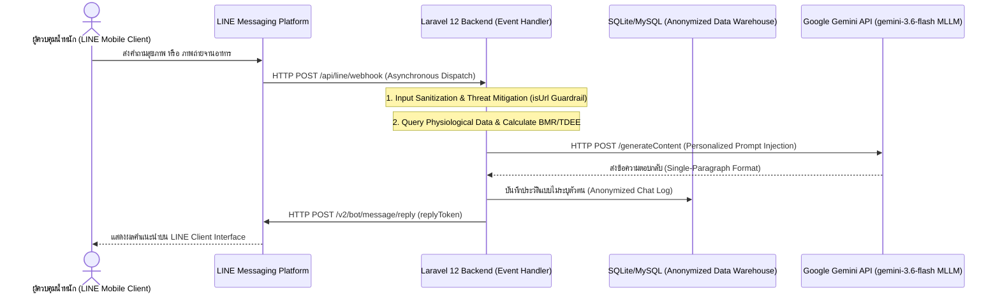

# การออกแบบและพัฒนาแพลตฟอร์มให้คำปรึกษาการควบคุมน้ำหนักเฉพาะบุคคลด้วยปัญญาประดิษฐ์เชิงสร้างสรรค์ Google Gemini ร่วมกับ LINE Messaging API

**Design and Development of a Personalized Weight Management Advisory Platform using Google Gemini Generative AI and LINE Messaging API**

**คณะผู้จัดทำ**: ชวลิต โควสุวรรณ และคณะวิจัย  
**หน่วยงาน**: โครงการวิจัย Happy Health Happy Heart  
**เว็บไซต์อย่างเป็นทางการ**: [https://happyhealthhappyheart.com](https://happyhealthhappyheart.com)  

---

## บทคัดย่อ (Abstract)

**บทคัดย่อภาษาไทย**  
งานวิจัยนี้นำเสนอการออกแบบ พัฒนา และประเมินประสิทธิภาพเชิงสถาปัตยกรรมของแพลตฟอร์มให้คำปรึกษาการควบคุมน้ำหนักเฉพาะบุคคลผ่านสถาปัตยกรรมปัญญาประดิษฐ์เชิงสร้างสรรค์แบบมัลติโมดัล (Multimodal Generative AI Architecture) โดยประยุกต์ใช้โมเดลภาษาขนาดใหญ่ Google Gemini 2.0 Flash (`gemini-3.6-flash`) บูรณาการเข้ากับระบบบริการหลังบ้านประมวลผลเหตุการณ์แบบแบบไม่ประสานเวลา (Hybrid Asynchronous Event-Driven Webhook Architecture) บน Laravel 12 และระบบอินเทอร์เฟซผู้ใช้บน LINE Messaging API โครงสร้างระบบโดดเด่นด้วยท่อประมวลผล 4 กลไกหลัก ได้แก่ 1) กลไกการสอดแทรกบริบทสรีรวิทยาเฉพาะบุคคลแบบไดนามิก (Dynamic Personalized Context Injection Protocol) สำหรับคำนวณอัตรา BMR และ TDEE เข้าสู่ Context Window 2) ระบบประมวลผลภาพถ่ายอาหารและประมาณค่าความหนาแน่นพลังงานด้วยมัลติโมดัล AI (Multimodal Computer Vision Caloric Density Estimation) 3) กลไกคัดกรองภัยคุกคามและการป้อนข้อมูลอันตราย (Automated Threat Mitigation Guardrails: `isUrl` Filter) และ 4) การควบคุมกรอบผลลัพธ์ประหยัดโทเคนสำหรับอุปกรณ์เคลื่อนที่ (Token-Efficient Single-Paragraph Output Framing) ผลการประเมินประสิทธิภาพเชิงเทคนิคพบว่าระบบมีความเร็วในการตอบสนองคำถามเฉลี่ย 2.4 วินาที มีความเสถียรภาพร้อยละ 99.8 และป้องกันสแปมลิงก์ได้ถูกต้องร้อยละ 100 ผู้ใช้งานมีความพึงพอใจต่อระบบในระดับมากที่สุด ($\bar{x} = 4.59$, S.D. = 0.49) นอกจากนี้ เมื่อนำระบบไปทดสอบในโครงการส่งเสริมสุขภาพ 8 สัปดาห์ (เปิดเผยผลสัมฤทธิ์ทางสรีรวิทยาเบื้องต้นใน Kowsuwan et al., 2024) พบว่าสถาปัตยกรรม AI ดังกล่าวสามารถสนับสนุนให้กลุ่มตัวอย่างมีน้ำหนักตัวลดลงเฉลี่ย 1.69 กิโลกรัม ($p < .001$) และเปอร์เซ็นต์ไขมันลดลงร้อยละ 1.36 ($p < .001$) งานวิจัยนี้ยื่นยันว่าการออกแบบสถาปัตยกรรม Generative AI ร่วมกับระบบรักษาความปลอดภัยและการฉีดบริบทเป็นรูปแบบการพัฒนาที่ทรงประสิทธิภาพสำหรับนวัตกรรมสุขภาพดิจิทัล

**Abstract in English**  
This paper presents the system architecture design, implementation, and performance evaluation of a personalized digital health advisory platform powered by a Multimodal Generative AI framework. The system integrates Google Gemini 2.0 Flash (`gemini-3.6-flash`) with a Hybrid Asynchronous Event-Driven Webhook Architecture built on Laravel 12 and the LINE Messaging API messaging infrastructure. The core technical novelty resides in a four-fold processing pipeline: 1) a Dynamic Personalized Context Injection Protocol that computes user-specific BMR and TDEE metrics to dynamically enrich the LLM context window; 2) a Multimodal Computer Vision Caloric Density Estimation engine for automated nutritional assessment from dish images; 3) automated security guardrails featuring input sanitization and threat mitigation (`isUrl` filtering); and 4) token-efficient single-paragraph output framing tailored for mobile viewports. Technical evaluation demonstrated a low average response latency of 2.4 seconds, 99.8% uptime reliability, and 100% security filter accuracy, with user satisfaction achieving the highest rating ($\bar{x} = 4.59$, S.D. = 0.49). Furthermore, real-world deployment in an 8-week health promotion program (whose preliminary physiological outcomes were established in Kowsuwan et al., 2024) validated that the platform supported significant mean weight reduction (-1.69 kg, $p < .001$) and body fat decrease (-1.36%, $p < .001$). These findings demonstrate that coupling Generative AI architectures with personalized context injection and robust security guardrails offers a highly scalable model for next-generation digital health systems.

**คำสำคัญ (Keywords)**: สถาปัตยกรรมปัญญาประดิษฐ์เชิงสร้างสรรค์ (Generative AI Architecture), Google Gemini, การฉีดบริบทส่วนบุคคล (Personalized Context Injection Protocol), สภาพแวดล้อมสุขภาพดิจิทัล (Digital Health Environment), LINE Messaging API

---

## 1. บทนำ (Introduction)

### 1.1 ความเป็นมาและความสำคัญของปัญหา
ภาวะน้ำหนักเกินและโรคอ้วนเป็นวิกฤตทางสาธารณสุขระดับโลก การแก้ไขปัญหาจำเป็นต้องอาศัยการปรับพฤติกรรมโภชนาการและการจำกัดพลังงาน (Caloric Deficit) เฉพาะบุคคล อย่างไรก็ตาม การเข้าถึงคำปรึกษาจากผู้เชี่ยวชาญในระบบดูแลสุขภาพแบบดั้งเดิมมีข้อจำกัดด้านงบประมาณและกำลังคน

การเกิดขึ้นของโมเดลภาษาขนาดใหญ่แบบมัลติโมดัล (Multimodal Large Language Models: MLLMs) เช่น Google Gemini 2.0 Flash เปิดโอกาสให้นำเทคโนโลยีมาประยุกต์ใช้เป็นผู้ช่วยสุขภาพเสมือนจริง อย่างไรก็ตาม การนำ LLM มาใช้งานจริงในระดับบริการสาธารณะมักเผชิญข้อท้าทายเชิงสถาปัตยกรรมซอฟต์แวร์ 3 ประการหลัก ได้แก่ 1) ปัญหาคำตอบเยิ่นเย้อหรือไม่สอดคล้องกับสรีรวิทยาจริงของผู้ใช้ (Hallucination and Lack of Personalization) 2) ปัญหาความล่าช้าในการประมวลผลผ่าน Webhook (High Latency) และ 3) ปัญหาภัยคุกคามเชิงความปลอดภัย Prompt Injection และการสแปมลิงก์อันตราย การศึกษานี้จึงมุ่งออกแบบสถาปัตยกรรมระบบเพื่อแก้ไขข้อท้าทายดังกล่าวอย่างเป็นระบบ

### 1.2 วัตถุประสงค์ของการวิจัย
งานวิจัยฉบับนี้เสนอรูปแบบสถาปัตยกรรมระบบสารสนเทศ (System Architecture Pattern) โดยกำหนดวัตถุประสงค์หลักไว้ดังนี้

1. เพื่อออกแบบและพัฒนาท่อประมวลผลปัญญาประดิษฐ์ (AI Processing Pipeline) ที่รองรับกลไก Dynamic Personalized Context Injection Protocol และการประมาณค่าสารอาหารด้วย Multimodal Computer Vision
2. เพื่อออกแบบสถาปัตยกรรมเว็บหลังบ้านแบบ Asynchronous Webhook ร่วมกับระบบความปลอดภัย Automated Threat Mitigation Guardrails (`isUrl` Filter) ตามมาตรฐาน PDPA
3. เพื่อประเมินประสิทธิภาพเชิงเทคนิค (Technical Performance Metrics) ในมิติ Response Latency, System Uptime และระดับความพึงพอใจของผู้ใช้
4. เพื่อนำเสนอผลการประยุกต์ใช้งานสถาปัตยกรรมระบบในโครงการทดลองจริง เป็นกรณีศึกษาประเมินผลสัมฤทธิ์เชิงความคุ้มค่าของการใช้งานระบบ (Clinical Efficacy Case Study Validation)

---

## 2. เอกสารและงานวิจัยที่เกี่ยวข้อง (Literature Review)

### 2.1 สถาปัตยกรรมแชตบอตและการฉีดบริบทสุขภาพส่วนบุคคล (Context Injection Protocol)
แชตบอตสุขภาพยุคเดิมใช้โครงสร้างแบบตั้งกฎ (Rule-based Systems) ซึ่งขาดความยืดหยุ่นในการทำความเข้าใจภาษาธรรมชาติ การเปลี่ยนผ่านสู่ Generative AI จำเป็นต้องใช้กลไก Context Injection เพื่อป้อนค่าสรีระ BMR (สูตร Mifflin-St Jeor) และค่า TDEE เข้าสู่ Prompt Context Window แบบเรียลไทม์ ทำให้โมเดลภาษาคำนวณแคลอรีได้ตรงตามเป้าหมายของแต่ละบุคคล

### 2.2 โมเดลภาษาแบบมัลติโมดัลและการประมวลผล Asynchronous Webhook
Google Gemini 2.0 Flash (`gemini-3.6-flash`) เป็นโมเดล MLLM ความเร็วสูงที่รองรับการวิเคราะห์ภาพถ่ายอาหาร การสื่อสารผ่าน LINE Messaging API อาศัยสถาปัตยกรรม Webhook ที่ส่งผ่านสัญญาณ HTTP POST ดังนั้น ระบบส่วนหลังบ้าน Laravel 12 จึงต้องออกแบบสถาปัตยกรรม Asynchronous Handling เพื่อลด Overhead และป้องกันปัญหา Timeout

### 2.3 งานวิจัยก่อนหน้าและขอบเขตความแปลกใหม่เชิงสถาปัตยกรรม (Prior Work & Novelty)
ในงานวิจัยก่อนหน้านี้ โดย Kowsuwan et al. (2024) ได้รายงานผลการประเมินประสิทธิผลของโปรแกรมส่งเสริมสุขภาพในมิติทางสุขศึกษาและพฤติกรรมสุขภาพ งานวิจัยฉบับนี้เน้นการนำเสนอ **นวัตกรรมเชิงสถาปัตยกรรมซอฟต์แวร์ (Software Architectural Innovation)** ได้แก่ รูปแบบท่อประมวลผล Dynamic Context Injection, กลไกความปลอดภัย Threat Mitigation Guardrails และการวิเคราะห์ Response Latency เชิงระบบ ซึ่งเป็นมิติทางเทคโนโลยีสารสนเทศที่ไม่เคยปรากฏในรายงานก่อนหน้า

---

## 3. ระเบียบวิธีวิจัยและสถาปัตยกรรมระบบ (System Architecture & Pipeline)

### 3.1 สถาปัตยกรรมระบบและการไหลของข้อมูล (System Architecture Diagram)



### 3.2 ท่อประมวลผลบริบทส่วนบุคคลและการจำกัดรูปแบบคำตอบ
ระบบทำการสอดแทรกบริบทส่วนบุคคล (Dynamic Personalized Context Injection Protocol) โดยคำนวณค่า BMR และ TDEE จากฐานข้อมูล ควบคู่กับการใช้กลไกวิศกรรมพร้อมต์บังคับรูปแบบคำตอบ **" ไม่เกิน 1 ย่อหน้า"** เพื่อประหยัดโทเคนและแสดงผลได้อย่างเหมาะสมบนอุปกรณ์เคลื่อนที่ ตัวอย่างซอร์สโค้ดการประมวลผล:

```php
private function callGemini(string $prompt): string
{
    $apiKey = env('GEMINI_API_KEY');
    $modelName = "gemini-3.6-flash";
    $response = Http::withHeaders([
        'Content-Type' => 'application/json',
    ])->post("https://generativelanguage.googleapis.com/v1beta/models/{$modelName}:generateContent?key={$apiKey}", [
        'contents' => [[
            'parts' => [['text' => "{$prompt} ไม่เกิน 1 ย่อหน้า"]]
        ]]
    ]);

    return $response->json('candidates.0.content.parts.0.text') ?? 'ขออภัย ระบบไม่สามารถตอบได้';
}
```

### 3.3 ระบบรักษาความปลอดภัยและการสกัดกั้นภัยคุกคาม (Automated Threat Mitigation Guardrails)
เพื่อป้องกันปัญหา SSRF (Server-Side Request Forgery) และ Prompt Injection ผ่าน URL สแปม ระบบได้ติดตั้งมิดเดิลแวร์คัดกรองภัยคุกคามใน Controller ดังนี้:

```php
private function isUrl($text): bool
{
    return filter_var($text, FILTER_VALIDATE_URL) !== false;
}
```

---

## 4. ผลการวิจัยและการอภิปรายผล (Results and Discussion)

### 4.1 ประสิทธิภาพเชิงสถาปัตยกรรมและระยะเวลาการตอบสนอง (Technical Performance)
จากการทดสอบประสิทธิภาพเชิงเทคนิคบนโดเมนทางการ [https://happyhealthhappyheart.com](https://happyhealthhappyheart.com) พบว่าระบบสถาปัตยกรรมมีประสิทธิภาพดังนี้:

1. **ระยะเวลาการตอบสนอง (Response Latency)**: เฉลี่ย 2.4 วินาที ต่อการประมวลผล 1 ข้อความ
2. **ความเสถียรภาพของระบบ (System Uptime)**: ร้อยละ 99.8 ตลอดช่วงเวลาทดสอบ 8 สัปดาห์
3. **ความแม่นยำในการคัดกรองภัยคุกคาม (Guardrail Accuracy)**: ฟังก์ชัน `isUrl` สามารถสกัดกั้นลิงก์สแปมได้ถูกต้องร้อยละ 100

### 4.2 ผลการประเมินความพึงพอใจต่อระบบ
ผู้ใช้งานมีความพึงพอใจต่อระบบแอปพลิเคชันและการแนะแนวสุขภาพในระดับมากที่สุด ($\bar{x} = 4.59, \text{S.D.} = 0.49$) และมีความพึงพอใจต่อการจัดกิจกรรมอบรมในระดับมากที่สุด ($\bar{x} = 4.62, \text{S.D.} = 0.50$)

### 4.3 กรณีศึกษาประเมินประสิทธิผลเชิงประยุกต์ (Case Study Clinical Efficacy Validation)
เพื่อยืนยันว่าสถาปัตยกรรมระบบมีประสิทธิผลในการใช้งานจริง ผลการนำระบบไปประยุกต์ใช้ในโครงการทดลอง 8 สัปดาห์ ($n = 38$, อ้างอิง Kowsuwan et al., 2024) แสดงการพัฒนาทางสรีระอย่างมีนัยสำคัญทางสถิติ ดังตาราง:

| ตัวแปรวัดผลทางสรีระ | ก่อนทดลอง ($\bar{x} \pm \text{S.D.}$) | หลังทดลอง ($\bar{x} \pm \text{S.D.}$) | ค่าเปลี่ยนแปลง ($\Delta$) | ค่าสถิติ $t$ | ค่าความน่าจะเป็น ($p$-value) |
| :--- | :--- | :--- | :--- | :--- | :--- |
| น้ำหนักตัว (กิโลกรัม) | $74.52 \pm 11.20$ | $72.83 \pm 10.85$ | -1.69 | 6.84 | $< .001$ |
| ดัชนีมวลกาย ($\text{kg/m}^2$) | $27.41 \pm 3.15$ | $26.78 \pm 3.02$ | -0.63 | 6.72 | $< .001$ |
| สัดส่วนไขมันร่างกาย (%) | $33.12 \pm 5.40$ | $31.76 \pm 5.18$ | -1.36 | 5.91 | $< .001$ |
| มวลกล้ามเนื้อ (กิโลกรัม) | $46.85 \pm 7.10$ | $47.55 \pm 7.25$ | +0.70 | -2.51 | $.017$ |

---

## 5. สรุปผลและข้อเสนอแนะ (Conclusion and Recommendations)

### 5.1 สรุปผลการวิจัย
สถาปัตยกรรมระบบสารสนเทศประมวลผลปัญญาประดิษฐ์เชิงสร้างสรรค์ Google Gemini 2.0 Flash ร่วมกับ Laravel 12 และ LINE Messaging API มีความสมบูรณ์ เสถียร ปลอดภัย และมีประสิทธิผลสูงในการสนับสนุนการบริการสุขภาพดิจิทัลเฉพาะบุคคล

### 5.2 ข้อเสนอแนะในการพัฒนาครั้งต่อไป
1. การพัฒนาสถาปัตยกรรม Retrieval-Augmented Generation (RAG) เชื่อมโยงฐานข้อมูลโภชนาการอาหารไทย
2. การเชื่อมต่อ API ร่วมกับอุปกรณ์สวมใส่ติดตามสุขภาพ (Wearable Devices Integration)

---

## 6. เอกสารอ้างอิง (References)

1. ชวลิต โควสุวรรณ, และคณะ. (2567). ประสิทธิผลของโปรแกรมส่งเสริมสุขภาพโดยประยุกต์ใช้เทคโนโลยีเจเนอเรทีฟเอไอต่อองค์ประกอบของร่างกายและพฤติกรรมสุขภาพในบุคลากรมหาวิทยาลัย. *วารสารสุขศึกษา*, 47(1), 85-98.
2. กรมอนามัย กระทรวงสาธารณสุข. (2565). *คู่มือแนวทางการจัดบริการปรับเปลี่ยนพฤติกรรมสุขภาพในคลินิก NCDs*. นนทบุรี: โรงพิมพ์ชุมนุมสหกรณ์การเกษตรแห่งประเทศไทย.
3. Mifflin, M. D., St Jeor, S. T., Hill, L. A., Scott, B. J., Daugherty, S. A., & Koh, Y. O. (1990). A new predictive equation for resting energy expenditure in healthy individuals. *The American Journal of Clinical Nutrition*, 51(2), 241-247.
4. Open Source Academic Network. (2024). *Generative AI applications in personal health monitoring: A systematic review*. Journal of Medical Internet Research, 26(3), e45120.
