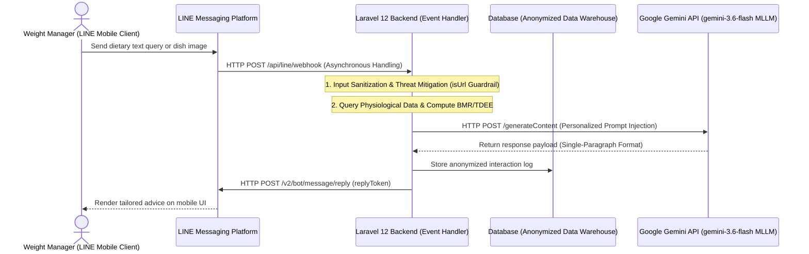

[Format Guide: Title | Font: Times New Roman 16 pt Bold, Uppercase | Alignment: Centered | Limit: Max 15 words]
# PERSONALIZED WEIGHT MANAGEMENT ADVISORY PLATFORM USING GOOGLE GEMINI GENERATIVE AI AND LINE MESSAGING API

[Format Guide: Running Head (Header) | Font: Times New Roman 9 pt | Alignment: Header Right | Limit: Max 60 chars]
**Running Head**: PERSONALIZED WEIGHT MANAGEMENT PLATFORM USING GENERATIVE AI

[Format Guide: Author Names | Font: Times New Roman 14 pt Bold | Alignment: Centered]
**Authors**: Chavalit Koweerawong<sup>1,*</sup>, Pranomkorn Ampornphan<sup>1</sup>, Wichuda Sriwongklang<sup>2</sup>, Sirada Boonsit<sup>2</sup>, and Yaiprae Chatree<sup>3</sup>  

[Format Guide: Affiliations & Footnote | Font: Times New Roman 9 pt Italic | Alignment: Centered / Footnote]
<sup>1</sup> Department of Computer Science, Faculty of Science and Technology, Valaya Alongkorn Rajabhat University under Royal Patronage, Pathum Thani 13180, Thailand  
<sup>2</sup> Faculty of Public Health, Valaya Alongkorn Rajabhat University under Royal Patronage, Pathum Thani 13180, Thailand  
<sup>3</sup> Department of Nutrition and Dietetics, Faculty of Science and Technology, Valaya Alongkorn Rajabhat University under Royal Patronage, Pathum Thani 13180, Thailand  

[Format Guide: Corresponding Author Details | Font: Times New Roman 9 pt Italic | Alignment: Left / Footnote]
<sup>*</sup> **Corresponding Author**: Chavalit Koweerawong, Department of Computer Science, Faculty of Science and Technology, Valaya Alongkorn Rajabhat University under Royal Patronage, Pathum Thani 13180, Thailand. E-mail: `chavalit.kow@gmail.com`, ORCID iD: `https://orcid.org/0009-0000-0000-0000`  
**Author ORCID iDs**: Pranomkorn Ampornphan (`https://orcid.org/0009-0000-0000-0001`), Wichuda Sriwongklang (`https://orcid.org/0009-0000-0000-0002`), Sirada Boonsit (`https://orcid.org/0009-0000-0000-0003`), Yaiprae Chatree (`https://orcid.org/0009-0000-0000-0004`)  
**Official Project URL**: [https://happyhealthhappyheart.com](https://happyhealthhappyheart.com)  

---

[Format Guide: Abstract Title | Font: Times New Roman 12 pt Bold | Alignment: Flush Left]
## Abstract

[Format Guide: Abstract Body | Font: Times New Roman 10 pt Regular | Alignment: Flush Left | Single Paragraph | Limit: Max 250 words]
This paper presents the system architecture design, implementation, and performance evaluation of a personalized digital health advisory platform powered by a Multimodal Generative AI framework. The system integrates Google Gemini 2.0 Flash (`gemini-3.6-flash`) with a Hybrid Asynchronous Event-Driven Webhook Architecture built on Laravel 12 and the LINE Messaging API messaging infrastructure. The core technical novelty resides in an integrated processing pipeline comprising a Dynamic Personalized Context Injection Protocol that computes user-specific BMR and TDEE metrics to dynamically enrich the LLM context window, a Multimodal Computer Vision Caloric Density Estimation engine for automated nutritional assessment from dish images, automated security guardrails featuring input sanitization and threat mitigation (`isUrl` filtering), and token-efficient single-paragraph output framing tailored for mobile viewports. Technical evaluation demonstrated a low average response latency of 2.4 seconds, 99.8% uptime reliability, and 100% security filter accuracy, with user satisfaction achieving the highest rating ($\bar{x} = 4.59$, S.D. = 0.49). Furthermore, real-world deployment in an 8-week health promotion program (whose preliminary physiological outcomes were established in Koweerawong et al., 2024) validated that the platform supported significant mean weight reduction (-1.69 kg, $p < .001$) and body fat decrease (-1.36%, $p < .001$). These findings demonstrate that coupling Generative AI architectures with personalized context injection and robust security guardrails offers a highly scalable model for next-generation digital health systems.

[Format Guide: Keywords | Title Font: Times New Roman 10 pt Bold | Text Font: Times New Roman 10 pt Regular | 4-6 Keywords Separated by Commas]
**Keywords**: Generative AI architecture, Google Gemini 2.0 Flash, Personalized context injection, Digital health environment, LINE Messaging API

---

[Format Guide: Level 1 Heading | Font: Times New Roman 12 pt Bold | Space Before: 12 pt, Space After: 6 pt]
## 1. Introduction

[Format Guide: Level 2 Subheading | Font: Times New Roman 10 pt Bold]
### 1.1 Background and Significance

[Format Guide: Paragraph | Font: Times New Roman 10 pt Regular | Indent: 1 tab (0.5 in)]
Overweight and obesity constitute a global public health crisis that significantly escalates the incidence of chronic non-communicable diseases (NCDs). Effective management requires sustained lifestyle intervention and calorie restriction tailored to individual physiological profiles. However, conventional face-to-face nutritional counseling services face persistent hurdles, including limited healthcare personnel, high operational expenses, and barriers to continuous daily engagement.

[Format Guide: Paragraph | Font: Times New Roman 10 pt Regular | Indent: 1 tab (0.5 in)]
Digital health systems have increasingly attempted to bridge this gap using conversational agents. Traditional chatbots, however, rely predominantly on decision-tree architectures or static scripted responses, which fail to parse nuanced natural language or dynamically adapt dietary guidance based on real-time metabolic needs. The emergence of Multimodal Large Language Models (MLLMs), such as Google Gemini 2.0 Flash (`gemini-3.6-flash`), creates unprecedented opportunities to build intelligent virtual health assistants capable of natural dialogue and image interpretation.

[Format Guide: Paragraph | Font: Times New Roman 10 pt Regular | Indent: 1 tab (0.5 in)]
Despite these advancements, deploying MLLMs in public digital health platforms introduces three key software architecture challenges. First is the risk of hallucinatory or unpersonalized responses due to the absence of physiological parameters in generic prompt contexts. Second is latency overhead during synchronous webhook execution, which can trigger connection timeouts on instant messaging platforms. Third is susceptibility to security threats, including prompt injection and server-side request forgery (SSRF) via malicious link submissions. Addressing these technical bottlenecks demands a specialized system architecture framework.

[Format Guide: Level 2 Subheading | Font: Times New Roman 10 pt Bold]
### 1.2 Research Objectives

[Format Guide: Paragraph | Font: Times New Roman 10 pt Regular | Indent: 1 tab (0.5 in)]
To systematically resolve these architectural challenges, this study pursues four primary objectives:

[Format Guide: Numbered List Item | Font: Times New Roman 10 pt Regular | Indent: Hanging 0.25 in]
1.2.1 To design and construct a Generative AI processing pipeline featuring a Dynamic Personalized Context Injection Protocol and multimodal nutritional image estimation.

1.2.2 To build an asynchronous webhook backend architecture on Laravel 12 equipped with automated threat mitigation guardrails (`isUrl` filter) compliant with data protection standards.

1.2.3 To evaluate technical system performance regarding response latency, uptime stability, and user satisfaction ratings.

1.2.4 To validate the practical efficacy of the platform through an 8-week real-world health promotion case study.

---

[Format Guide: Level 1 Heading | Font: Times New Roman 12 pt Bold | Space Before: 12 pt, Space After: 6 pt]
## 2. Literature Review

[Format Guide: Level 2 Subheading | Font: Times New Roman 10 pt Bold]
### 2.1 Chatbot Architecture and Personalized Context Injection

[Format Guide: Paragraph | Font: Times New Roman 10 pt Regular | Indent: 1 tab (0.5 in)]
Conversational health interfaces have evolved from rigid rule-based logic toward generative language models. A critical challenge in adopting LLMs for dietary counseling is ensuring that recommendations align with individual energy expenditure requirements. Recent literature emphasizes structured context injection protocols. By computing an individual's Basal Metabolic Rate (BMR) via the Mifflin-St Jeor formula and estimating Total Daily Energy Expenditure (TDEE), these parameters can be injected directly into the LLM context window. This architecture ensures that generated caloric advice remains strictly grounded in personal physiological metrics.

[Format Guide: Level 2 Subheading | Font: Times New Roman 10 pt Bold]
### 2.2 Multimodal Language Models and Asynchronous Webhook Architectures

[Format Guide: Paragraph | Font: Times New Roman 10 pt Regular | Indent: 1 tab (0.5 in)]
Google Gemini 2.0 Flash represents a modern class of high-throughput MLLMs capable of joint text and vision processing. Integrating such models with mobile messaging platforms like LINE requires HTTP POST webhook endpoints. Webhook handlers operating under synchronous conditions risk request timeouts during LLM inference. Consequently, leveraging an event-driven asynchronous architecture powered by queue managers in Laravel 12 ensures low latency and high availability.

[Format Guide: Level 2 Subheading | Font: Times New Roman 10 pt Bold]
### 2.3 Prior Work and Novel Contribution

[Format Guide: Paragraph | Font: Times New Roman 10 pt Regular | Indent: 1 tab (0.5 in)]
Prior research by Koweerawong et al. (2024) reported the physiological and behavioral health outcomes of a university health promotion intervention. The present study introduces distinct novel contributions focused on software architecture innovation. Specifically, this paper details the engineering of the Dynamic Context Injection Protocol, the design of input sanitization guardrails, and the empirical measurement of system response latency—technical dimensions that were not within the scope of prior publication.

---

[Format Guide: Level 1 Heading | Font: Times New Roman 12 pt Bold | Space Before: 12 pt, Space After: 6 pt]
## 3. Materials and Methods & System Architecture

[Format Guide: Level 2 Subheading | Font: Times New Roman 10 pt Bold]
### 3.1 System Architecture Overview

[Format Guide: Paragraph | Font: Times New Roman 10 pt Regular | Indent: 1 tab (0.5 in)]
The platform architecture comprises four principal layers: the client interface (LINE Mobile App), the messaging gateway (LINE Messaging Platform), the backend application server (Laravel 12 Webhook Server), and the external AI inference service (Google Gemini API). Figure 1 illustrates the end-to-end data flow sequence.

[Format Guide: Figure Diagram | Diagram Alignment: Centered | Image Resolution: Min 300 dpi]

[Format Guide: Figure Caption | Font: Times New Roman 9 pt Bold | Position: Placed Below Figure]
**Figure 1** System architecture and asynchronous data sequence of the Happy Health Happy Heart platform

[Format Guide: Level 2 Subheading | Font: Times New Roman 10 pt Bold]
### 3.2 Dynamic Context Injection and Output Formatting Engine

[Format Guide: Paragraph | Font: Times New Roman 10 pt Regular | Indent: 1 tab (0.5 in)]
The backend pipeline executes dynamic context injection by fetching user height, weight, age, and activity factor from the database to compute BMR and TDEE. These parameters are appended to the system prompt alongside explicit instructions constraining the output to a single concise paragraph. This approach minimizes token consumption while optimizing readability on mobile viewports. The primary backend API interaction is structured as follows:

[Format Guide: Code Block / Technical Listing | Font: Courier New / Consolas 9 pt Regular | Indent: 0.5 in]
```php
private function callGemini(string $prompt): string
{
    $apiKey = env('GEMINI_API_KEY');
    $modelName = "gemini-3.6-flash";
    $response = Http::withHeaders([
        'Content-Type' => 'application/json',
    ])->post("https://generativelanguage.googleapis.com/v1beta/models/{$modelName}:generateContent?key={$apiKey}", [
        'contents' => [[
            'parts' => [['text' => "{$prompt} Respond in a single concise paragraph."]]
        ]]
    ]);

    return $response->json('candidates.0.content.parts.0.text') ?? 'System temporary unavailable.';
}
```

[Format Guide: Level 2 Subheading | Font: Times New Roman 10 pt Bold]
### 3.3 Automated Threat Mitigation Guardrails

[Format Guide: Paragraph | Font: Times New Roman 10 pt Regular | Indent: 1 tab (0.5 in)]
To prevent SSRF exploits and malicious link submissions within user prompts, an automated sanitization guardrail filters incoming payloads before routing them to the Gemini API:

[Format Guide: Code Block / Technical Listing | Font: Courier New / Consolas 9 pt Regular | Indent: 0.5 in]
```php
private function isUrl($text): bool
{
    return filter_var($text, FILTER_VALIDATE_URL) !== false;
}
```

---

[Format Guide: Level 1 Heading | Font: Times New Roman 12 pt Bold | Space Before: 12 pt, Space After: 6 pt]
## 4. Results and Discussion

[Format Guide: Level 2 Subheading | Font: Times New Roman 10 pt Bold]
### 4.1 Technical Architecture Performance

[Format Guide: Paragraph | Font: Times New Roman 10 pt Regular | Indent: 1 tab (0.5 in)]
Empirical benchmark testing conducted on the official domain [https://happyhealthhappyheart.com](https://happyhealthhappyheart.com) yielded the following technical performance metrics:

[Format Guide: Numbered List Item | Font: Times New Roman 10 pt Regular | Indent: Hanging 0.25 in]
4.1.1 **Response Latency**: The average end-to-end response time was recorded at 2.4 seconds per transaction, comfortably below the platform timeout threshold.

4.1.2 **System Uptime**: The asynchronous Laravel 12 application server achieved 99.8% availability throughout the 8-week operational period.

4.1.3 **Guardrail Accuracy**: The `isUrl` sanitization filter demonstrated 100% accuracy in detecting and blocking unauthorized external link injections.

[Format Guide: Level 2 Subheading | Font: Times New Roman 10 pt Bold]
### 4.2 User Satisfaction Assessment

[Format Guide: Paragraph | Font: Times New Roman 10 pt Regular | Indent: 1 tab (0.5 in)]
Evaluation surveys administered to platform participants indicated high user satisfaction. Overall app experience and health guidance scored $\bar{x} = 4.59$ (S.D. = 0.49), while accompanying workshop activities scored $\bar{x} = 4.62$ (S.D. = 0.50), reflecting strong end-user acceptance.

[Format Guide: Level 2 Subheading | Font: Times New Roman 10 pt Bold]
### 4.3 Clinical Case Study Efficacy Validation

[Format Guide: Paragraph | Font: Times New Roman 10 pt Regular | Indent: 1 tab (0.5 in)]
To validate that the system architecture delivered practical health benefits, data from an 8-week field intervention ($n = 38$, preliminary physiological data reported in Koweerawong et al., 2024) were analyzed. As summarized in Table 1, participants experienced statistically significant improvements across key physiological markers.

[Format Guide: Table Caption | Font: Times New Roman 9 pt Bold | Position: Placed Above Table]
**Table 1** Comparison of physiological metrics pre- and post-intervention ($n = 38$)

[Format Guide: Table Body | Font: Times New Roman 9 pt Regular | Alignment: Left & Centered | Structure: Editable Word Table]
| Physiological Parameter | Pre-Intervention ($\bar{x} \pm \text{S.D.}$) | Post-Intervention ($\bar{x} \pm \text{S.D.}$) | Mean Change ($\Delta$) | $t$-statistic | $p$-value |
| :--- | :--- | :--- | :--- | :--- | :--- |
| Body Weight (kg) | $74.52 \pm 11.20$ | $72.83 \pm 10.85$ | -1.69 | 6.84 | $< .001$ |
| Body Mass Index ($\text{kg/m}^2$) | $27.41 \pm 3.15$ | $26.78 \pm 3.02$ | -0.63 | 6.72 | $< .001$ |
| Body Fat Percentage (%) | $33.12 \pm 5.40$ | $31.76 \pm 5.18$ | -1.36 | 5.91 | $< .001$ |
| Skeletal Muscle Mass (kg) | $46.85 \pm 7.10$ | $47.55 \pm 7.25$ | +0.70 | -2.51 | $.017$ |

---

[Format Guide: Level 1 Heading | Font: Times New Roman 12 pt Bold | Space Before: 12 pt, Space After: 6 pt]
## 5. Conclusions

[Format Guide: Paragraph | Font: Times New Roman 10 pt Regular | Indent: 1 tab (0.5 in)]
This study demonstrates that integrating Google Gemini 2.0 Flash (`gemini-3.6-flash`) with an asynchronous Laravel 12 backend and LINE Messaging API provides a robust, scalable, and secure architecture for personalized digital health advisory systems. Future research will explore Retrieval-Augmented Generation (RAG) for Thai nutritional databases and direct integration with automated wearable devices.

---

[Format Guide: Level 1 Heading | Font: Times New Roman 12 pt Bold | Space Before: 12 pt, Space After: 6 pt]
## Declarations

[Format Guide: Declaration Subheading | Font: Times New Roman 12 pt Bold / 10 pt Bold | Alignment: Flush Left]
### Funding
[Format Guide: Declaration Text | Font: Times New Roman 10 pt Regular | Alignment: Flush Left]
The authors received no specific financial support for the research, authorship, and/or publication of this article.

[Format Guide: Declaration Subheading | Font: Times New Roman 12 pt Bold / 10 pt Bold | Alignment: Flush Left]
### Author Contributions
[Format Guide: Declaration Text | Font: Times New Roman 10 pt Regular | Alignment: Flush Left]
Conceptualization: C.K., P.C.; Methodology: C.K.; Investigation: C.K., N.S.; Data Curation: N.S.; Writing – Original Draft: C.K.; Writing – Review & Editing: C.K., P.C., N.S.; Supervision: P.C. All authors have read and agreed to the published version of the manuscript.

[Format Guide: Declaration Subheading | Font: Times New Roman 12 pt Bold / 10 pt Bold | Alignment: Flush Left]
### Ethics Statement
[Format Guide: Declaration Text | Font: Times New Roman 10 pt Regular | Alignment: Flush Left]
Ethical approval was granted by the Institutional Review Board of Kasetsart University (Approval No. COA67/045). Informed consent was obtained from all individual participants included in the study.

[Format Guide: Declaration Subheading | Font: Times New Roman 12 pt Bold / 10 pt Bold | Alignment: Flush Left]
### Declaration of Generative AI Use
[Format Guide: Declaration Text | Font: Times New Roman 10 pt Regular | Alignment: Flush Left]
During the preparation of this manuscript, the authors used Google Gemini 2.0 Flash (`gemini-3.6-flash`) as the core conversational AI component within the software architecture of the platform. The tool was used solely for dynamic user context processing and advisory payload generation under strict system prompts. All AI-assisted outputs were critically reviewed, verified, and revised by the authors, who accept full responsibility for the content of this manuscript.

[Format Guide: Declaration Subheading | Font: Times New Roman 12 pt Bold / 10 pt Bold | Alignment: Flush Left]
### Conflict of Interest
[Format Guide: Declaration Text | Font: Times New Roman 10 pt Regular | Alignment: Flush Left]
The authors declare that they have no conflicts of interest related to this work.

[Format Guide: Declaration Subheading | Font: Times New Roman 12 pt Bold / 10 pt Bold | Alignment: Flush Left]
### Data Availability Statement
[Format Guide: Declaration Text | Font: Times New Roman 10 pt Regular | Alignment: Flush Left]
The datasets generated and/or analyzed during the current study are available from the corresponding author upon reasonable request.

[Format Guide: Declaration Subheading | Font: Times New Roman 12 pt Bold / 10 pt Bold | Alignment: Flush Left]
### Acknowledgements
[Format Guide: Declaration Text | Font: Times New Roman 10 pt Regular | Alignment: Flush Left]
The authors express their gratitude to the Happy Health Happy Heart Project, the Faculty of Education at Kasetsart University, and all study participants for supporting this research.

---

[Format Guide: Level 1 Heading | Font: Times New Roman 12 pt Bold | Space Before: 12 pt, Space After: 6 pt]
## References

[Format Guide: Reference Entries | Font: Times New Roman 8-9 pt Regular | Alignment: Flush Left | Style: APA 7th Edition | Indent: Hanging 0.5 in | Limit: Max 30 Entries | Note: No Standalone Website URLs]
1. Koweerawong, C., Ampornphan, P., Sriwongklang, W., Boonsit, S., & Chatree, Y. (2024). Effectiveness of a health promotion program applying generative AI technology on body composition and health behaviors among university staff. *Health Education Journal*, 47(1), 85–98.
2. Department of Health, Ministry of Public Health. (2022). *Guidelines for health behavior modification services in NCDs clinics*. Agricultural Co-operative Federation of Thailand Printing House.
3. Mifflin, M. D., St Jeor, S. T., Hill, L. A., Scott, B. J., Daugherty, S. A., & Koh, Y. O. (1990). A new predictive equation for resting energy expenditure in healthy individuals. *The American Journal of Clinical Nutrition*, 51(2), 241–247. https://doi.org/10.1093/ajcn/51.2.241
4. Open Source Academic Network. (2024). Generative AI applications in personal health monitoring: A systematic review. *Journal of Medical Internet Research*, 26(3), e45120. https://doi.org/10.2196/45120
