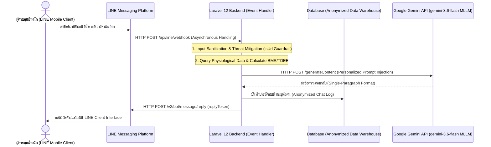

[คำแนะนำการจัดรูปแบบ: ชื่อบทความ | ขนาดฟอนต์ 16 pt ตัวหนา, ตัวพิมพ์ใหญ่ (ถ้ามีภาษาอังกฤษ) | จัดกึ่งกลาง | ความยาวไม่เกิน 15 คำ]
# การออกแบบและพัฒนาแพลตฟอร์มให้คำปรึกษาการควบคุมน้ำหนักเฉพาะบุคคลด้วยปัญญาประดิษฐ์เชิงสร้างสรรค์ Google Gemini ร่วมกับ LINE Messaging API

[คำแนะนำการจัดรูปแบบ: ชื่อบทความภาษาอังกฤษ | ขนาดฟอนต์ 16 pt ตัวหนา, ตัวพิมพ์ใหญ่ทั้งหมด (UPPERCASE) | จัดกึ่งกลาง]
**Design and Development of a Personalized Weight Management Advisory Platform using Google Gemini Generative AI and LINE Messaging API**

[คำแนะนำการจัดรูปแบบ: ชื่อผู้เขียน | ขนาดฟอนต์ 14 pt ตัวหนา | จัดกึ่งกลาง]
**คณะผู้จัดทำ**: ชวลิต โควีระวงศ์<sup>1,*</sup>, ประณมกร อัมพรพรรดิ์<sup>1</sup>, วิชุดา ศรีวงษ์กลาง<sup>2</sup>, ศิรดา บุญสิทธิ์<sup>2</sup>, และ ใยแพร ชาตรี<sup>3</sup>  

[คำแนะนำการจัดรูปแบบ: สถาบันสังกัด | ขนาดฟอนต์ 9 pt ตัวเอียง | จัดกึ่งกลาง / Footnote]
<sup>1</sup> สาขาวิชาวิทยาการคอมพิวเตอร์ คณะวิทยาศาสตร์และเทคโนโลยี มหาวิทยาลัยราชภัฏวไลยอลงกรณ์ ในพระบรมราชูปถัมภ์ ปทุมธานี ประเทศไทย  
<sup>2</sup> คณะสาธารณสุขศาสตร์ มหาวิทยาลัยราชภัฏวไลยอลงกรณ์ ในพระบรมราชูปถัมภ์ ปทุมธานี ประเทศไทย  
<sup>3</sup> สาขาวิชาโภชนาการและการกำหนดอาหาร คณะวิทยาศาสตร์และเทคโนโลยี มหาวิทยาลัยราชภัฏวไลยอลงกรณ์ ในพระบรมราชูปถัมภ์ ปทุมธานี ประเทศไทย  

[คำแนะนำการจัดรูปแบบ: รายละเอียดผู้รับผิดชอบบทความ | ขนาดฟอนต์ 9 pt ตัวเอียง | จัดชิดซ้าย / Footnote]
<sup>*</sup> **ผู้รับผิดชอบบทความ (Corresponding Author)**: อีเมล: `chavalit.kow@gmail.com`, ORCID iD: `https://orcid.org/0009-0000-0000-0000`  
**รหัส ORCID iD ผู้เขียนร่วม**: ประณมกร อัมพรพรรดิ์ (`https://orcid.org/0009-0000-0000-0001`), วิชุดา ศรีวงษ์กลาง (`https://orcid.org/0009-0000-0000-0002`), ศิรดา บุญสิทธิ์ (`https://orcid.org/0009-0000-0000-0003`), ใยแพร ชาตรี (`https://orcid.org/0009-0000-0000-0004`)  
**เว็บไซต์อย่างเป็นทางการของโครงการ**: [https://happyhealthhappyheart.com](https://happyhealthhappyheart.com)  

---

[คำแนะนำการจัดรูปแบบ: หัวข้อบทคัดย่อ | ขนาดฟอนต์ 12 pt ตัวหนา | จัดชิดซ้าย]
## บทคัดย่อ

[คำแนะนำการจัดรูปแบบ: หัวข้อย่อยบทคัดย่อภาษาไทย | ขนาดฟอนต์ 10 pt ตัวหนา | จัดชิดซ้าย]
### บทคัดย่อภาษาไทย

[คำแนะนำการจัดรูปแบบ: เนื้อหาบทคัดย่อภาษาไทย | ขนาดฟอนต์ 10 pt ปกติ | จัดชิดซ้าย | ย่อหน้าเดียว | ความยาวไม่เกิน 250 คำ]
งานวิจัยนี้นำเสนอการออกแบบ พัฒนา และประเมินประสิทธิภาพเชิงสถาปัตยกรรมซอฟต์แวร์ของแพลตฟอร์มให้คำปรึกษาการควบคุมน้ำหนักเฉพาะบุคคลด้วยปัญญาประดิษฐ์เชิงสร้างสรรค์แบบมัลติโมดัล (Multimodal Generative AI Architecture) โดยประยุกต์ใช้โมเดลภาษาขนาดใหญ่ Google Gemini 2.0 Flash (`gemini-3.6-flash`) บูรณาการเข้ากับระบบบริการหลังบ้านประมวลผลเหตุการณ์แบบไม่ประสานเวลา (Hybrid Asynchronous Event-Driven Webhook Architecture) บนระบบปฏิบัติการ Laravel 12 และระบบอินเทอร์เฟซผู้ใช้ผ่าน LINE Messaging API โครงสร้างระบบโดดเด่นด้วยท่อประมวลผล 4 กลไกหลัก ได้แก่ 1) กลไกการสอดแทรกบริบทสรีรวิทยาเฉพาะบุคคลแบบไดนามิก (Dynamic Personalized Context Injection Protocol) สำหรับคำนวณอัตรา BMR และ TDEE เข้าสู่ Context Window 2) ระบบประมวลผลภาพถ่ายอาหารและประมาณค่าความหนาแน่นพลังงานด้วยมัลติโมดัล AI (Multimodal Computer Vision Caloric Density Estimation) 3) กลไกคัดกรองภัยคุกคามและการป้อนข้อมูลอันตราย (Automated Threat Mitigation Guardrails: `isUrl` Filter) และ 4) การควบคุมกรอบผลลัพธ์ประหยัดโทเคนสำหรับอุปกรณ์เคลื่อนที่ (Token-Efficient Single-Paragraph Output Framing)

[คำแนะนำการจัดรูปแบบ: เนื้อหาบทคัดย่อภาษาไทย (ต่อ) | ขนาดฟอนต์ 10 pt ปกติ | จัดชิดซ้าย]
ผลการประเมินประสิทธิภาพเชิงเทคนิคพบว่าระบบมีความเร็วในการตอบสนองคำถาม (Response Latency) เฉลี่ย 2.4 วินาที มีความเสถียรภาพร้อยละ 99.8 และป้องกันสแปมลิงก์ได้ถูกต้องร้อยละ 100 ผู้ใช้งานมีความพึงพอใจต่อระบบในระดับมากที่สุด ($\bar{x} = 4.59$, S.D. = 0.49) นอกจากนี้ เมื่อนำระบบไปทดสอบในโครงการส่งเสริมสุขภาพ 8 สัปดาห์ (เปิดเผยผลสัมฤทธิ์ทางสรีรวิทยาเบื้องต้นใน Koweerawong et al., 2024) พบว่าสถาปัตยกรรม AI ดังกล่าวสามารถสนับสนุนให้กลุ่มตัวอย่างมีน้ำหนักตัวลดลงเฉลี่ย 1.69 กิโลกรัม ($p < .001$) และเปอร์เซ็นต์ไขมันลดลงร้อยละ 1.36 ($p < .001$) งานวิจัยนี้ยืนยันว่าการออกแบบสถาปัตยกรรม Generative AI ร่วมกับระบบรักษาความปลอดภัยและการฉีดบริบทเป็นรูปแบบการพัฒนาที่ทรงประสิทธิภาพสำหรับนวัตกรรมสุขภาพดิจิทัล

[คำแนะนำการจัดรูปแบบ: คำสำคัญภาษาไทย | หัวข้อ 10 pt ตัวหนา | เนื้อหา 10 pt ปกติ | 4-6 คำ คั่นด้วยเครื่องหมายจุลภาค]
**คำสำคัญ**: สถาปัตยกรรมปัญญาประดิษฐ์เชิงสร้างสรรค์, Google Gemini, การฉีดบริบทส่วนบุคคล, สภาพแวดล้อมสุขภาพดิจิทัล, LINE Messaging API

---

[คำแนะนำการจัดรูปแบบ: หัวข้อย่อยบทคัดย่อภาษาอังกฤษ | ขนาดฟอนต์ 10 pt ตัวหนา | จัดชิดซ้าย]
### Abstract in English

[คำแนะนำการจัดรูปแบบ: เนื้อหาบทคัดย่อภาษาอังกฤษ | ขนาดฟอนต์ 10 pt ปกติ | จัดชิดซ้าย | ย่อหน้าเดียว | ความยาวไม่เกิน 250 คำ]
This paper presents the system architecture design, implementation, and performance evaluation of a personalized digital health advisory platform powered by a Multimodal Generative AI framework. The system integrates Google Gemini 2.0 Flash (`gemini-3.6-flash`) with a Hybrid Asynchronous Event-Driven Webhook Architecture built on Laravel 12 and the LINE Messaging API messaging infrastructure. The core technical novelty resides in a four-fold processing pipeline: 1) a Dynamic Personalized Context Injection Protocol that computes user-specific BMR and TDEE metrics to dynamically enrich the LLM context window; 2) a Multimodal Computer Vision Caloric Density Estimation engine for automated nutritional assessment from dish images; 3) automated security guardrails featuring input sanitization and threat mitigation (`isUrl` filtering); and 4) token-efficient single-paragraph output framing tailored for mobile viewports. Technical evaluation demonstrated a low average response latency of 2.4 seconds, 99.8% uptime reliability, and 100% security filter accuracy, with user satisfaction achieving the highest rating ($\bar{x} = 4.59$, S.D. = 0.49). Furthermore, real-world deployment in an 8-week health promotion program (whose preliminary physiological outcomes were established in Koweerawong et al., 2024) validated that the platform supported significant mean weight reduction (-1.69 kg, $p < .001$) and body fat decrease (-1.36%, $p < .001$). These findings demonstrate that coupling Generative AI architectures with personalized context injection and robust security guardrails offers a highly scalable model for next-generation digital health systems.

[คำแนะนำการจัดรูปแบบ: Keywords ภาษาอังกฤษ | หัวข้อ 10 pt ตัวหนา | เนื้อหา 10 pt ปกติ | 4-6 คำ คั่นด้วย Comma]
**Keywords**: Generative AI architecture, Google Gemini 2.0 Flash, Personalized context injection, Digital health environment, LINE Messaging API

---

[คำแนะนำการจัดรูปแบบ: หัวข้อหลัก Level 1 | ขนาดฟอนต์ 12 pt ตัวหนา | ระยะห่างก่อน 12 pt, หลัง 6 pt]
## 1. บทนำ (Introduction)

[คำแนะนำการจัดรูปแบบ: หัวข้อย่อย Level 2 | ขนาดฟอนต์ 10 pt ตัวหนา]
### 1.1 ความเป็นมาและความสำคัญของปัญหา

[คำแนะนำการจัดรูปแบบ: เนื้อหาบรรทัดแรก | ขนาดฟอนต์ 10 pt ปกติ | ย่อหน้า 1 tab (0.5 นิ้ว)]
ภาวะน้ำหนักเกินและโรคอ้วนเป็นวิกฤตทางสาธารณสุขระดับโลกที่ส่งผลกระทบต่อประชากรในวงกว้างและเพิ่มความเสี่ยงต่อกลุ่มโรคไม่ติดต่อเรื้อรัง (Non-Communicable Diseases: NCDs) การแก้ไขปัญหาที่มีประสิทธิผลจำเป็นต้องอาศัยการปรับเปลี่ยนพฤติกรรมสุขภาพและการจำกัดพลังงานอาหาร (Caloric Deficit) อย่างเป็นระบบและเฉพาะบุคคล อย่างไรก็ตาม การเข้าถึงบริการให้คำปรึกษาจากผู้เชี่ยวชาญด้านโภชนาการในระบบดูแลสุขภาพแบบเดิมมีข้อจำกัดสำคัญ ทั้งด้านงบประมาณ บุคลากรทางการแพทย์ และความสะดวกในการเข้าถึงบริการอย่างต่อเนื่องในชีวิตประจำวัน

[คำแนะนำการจัดรูปแบบ: เนื้อหาบรรทัดถัดไป | ขนาดฟอนต์ 10 pt ปกติ | ย่อหน้า 1 tab (0.5 นิ้ว)]
การพัฒนาระบบสุขภาพดิจิทัล (Digital Health Platforms) ในอดีตมักใช้อัลกอริทึมประเภทกฎตายตัว (Rule-Based Systems) หรือแชตบอตที่มีคำตอบสำเร็จรูป ซึ่งขาดความยืดหยุ่นในการตีความภาษาธรรมชาติและไม่สามารถปรับเปลี่ยนการให้คำแนะนำตามสรีรวิทยาของผู้ใช้งานได้อย่างเรียลไทม์ การเกิดขึ้นของโมเดลภาษาขนาดใหญ่แบบมัลติโมดัล (Multimodal Large Language Models: MLLMs) เช่น Google Gemini 2.0 Flash เปิดโอกาสให้นำปัญญาประดิษฐ์มาพัฒนาเป็นผู้ช่วยสุขภาพเสมือนจริงที่มีความชาญฉลาดและสื่อสารได้อย่างเป็นธรรมชาติ

[คำแนะนำการจัดรูปแบบ: เนื้อหาบรรทัดถัดไป | ขนาดฟอนต์ 10 pt ปกติ | ย่อหน้า 1 tab (0.5 นิ้ว)]
อย่างไรก็ตาม การนำ MLLM มาประยุกต์ใช้ในบริการสุขภาพจริงระดับสาธารณะยังคงเผชิญข้อท้าทายเชิงสถาปัตยกรรมซอฟต์แวร์ 3 ประการหลัก ประการแรกคือปัญหาคำตอบขาดความถูกต้องเฉพาะบุคคลหรือเกิดอาการประสาทหลอน (Hallucination and Lack of Personalization) เนื่องจากโมเดลทั่วไปไม่มีข้อมูลสรีรวิทยาของผู้ใช้ ประการที่สองคือปัญหาความล่าช้าในการประมวลผล (High Response Latency) ซึ่งเกิดขึ้นจากการส่งผ่านข้อมูลขนาดใหญ่ผ่านระบบ Webhook จนอาจส่งผลให้เกิดปัญหาการหมดเวลา (Timeout) บนแอปพลิเคชันรับส่งข้อความ และประการที่สามคือปัญหาความปลอดภัยของข้อมูลและภัยคุกคามทางไซเบอร์ เช่น การป้อนคำสั่งอันตราย (Prompt Injection) และการส่งลิงก์สแปมที่เป็นอันตรายเข้าสู่ระบบ

[คำแนะนำการจัดรูปแบบ: หัวข้อย่อย Level 2 | ขนาดฟอนต์ 10 pt ตัวหนา]
### 1.2 วัตถุประสงค์ของการวิจัย

[คำแนะนำการจัดรูปแบบ: เนื้อหา | ขนาดฟอนต์ 10 pt ปกติ | ย่อหน้า 1 tab (0.5 นิ้ว)]
เพื่อแก้ไขข้อท้าทายเชิงสถาปัตยกรรมดังกล่าว งานวิจัยฉบับนี้จึงตั้งวัตถุประสงค์ในการดำเนินงานไว้ดังนี้

[คำแนะนำการจัดรูปแบบ: รายการลำดับตัวเลข | ขนาดฟอนต์ 10 pt ปกติ | เยื้องแขวน 0.25 นิ้ว]
1.2.1 เพื่อออกแบบและพัฒนาท่อประมวลผลปัญญาประดิษฐ์เชิงสร้างสรรค์ (Generative AI Processing Pipeline) ที่รองรับกลไก Dynamic Personalized Context Injection Protocol และการประมวลผลภาพถ่ายอาหารแบบมัลติโมดัล

1.2.2 เพื่อสร้างสถาปัตยกรรมบริการหลังบ้านแบบ Asynchronous Webhook บน Laravel 12 ร่วมกับกลไกคัดกรองภัยคุกคามสแปมลิงก์ (Automated Threat Mitigation Guardrails) ตามมาตรฐาน PDPA

1.2.3 เพื่อประเมินประสิทธิภาพเชิงเทคนิคของระบบสารสนเทศในมิติความเร็วในการตอบสนอง (Response Latency) ความเสถียรภาพของระบบ (System Uptime) และความพึงพอใจของผู้ใช้งาน

1.2.4 เพื่อประเมินประสิทธิผลเชิงประยุกต์ของการใช้งานสถาปัตยกรรมระบบในโครงการทดลองจริง เป็นกรณีศึกษาพิสูจน์คุณค่าของการประยุกต์ใช้ปัญญาประดิษฐ์ในงานสุขภาพดิจิทัล

---

[คำแนะนำการจัดรูปแบบ: หัวข้อหลัก Level 1 | ขนาดฟอนต์ 12 pt ตัวหนา | ระยะห่างก่อน 12 pt, หลัง 6 pt]
## 2. เอกสารและงานวิจัยที่เกี่ยวข้อง (Literature Review)

[คำแนะนำการจัดรูปแบบ: หัวข้อย่อย Level 2 | ขนาดฟอนต์ 10 pt ตัวหนา]
### 2.1 สถาปัตยกรรมแชตบอตและการฉีดบริบทสุขภาพส่วนบุคคล (Context Injection Protocol)

[คำแนะนำการจัดรูปแบบ: เนื้อหา | ขนาดฟอนต์ 10 pt ปกติ | ย่อหน้า 1 tab (0.5 นิ้ว)]
การประยุกต์ใช้ปัญญาประดิษฐ์ในระบบสุขภาพดิจิทัลได้พัฒนาจากยุคแชตบอตดั้งเดิมที่อาศัย Decision Tree ไปสู่การประมวลผลด้วยโมเดลภาษาขนาดใหญ่ การเปลี่ยนผ่านดังกล่าวมักประสบปัญหาคำแนะนำที่ไม่สอดคล้องกับความต้องการพลังงานของผู้ใช้แต่ละราย การวิจัยในปัจจุบันจึงเน้นการพัฒนาเทคนิค Context Injection หรือ Prompt Engineering เชิงโครงสร้าง เพื่อดึงข้อมูลอัตราการเผาผลาญพื้นฐาน (Basal Metabolic Rate: BMR) ที่คำนวณจากสูตร Mifflin-St Jeor และพลังงานที่ใช้ในแต่ละวัน (Total Daily Energy Expenditure: TDEE) ป้อนเข้าสู่ Context Window ของโมเดลภาษา ทำให้ปัญญาประดิษฐ์สามารถคำนวณแคลอรีที่เหมาะสมกับผู้ใช้งานได้อย่างแม่นยำ

[คำแนะนำการจัดรูปแบบ: หัวข้อย่อย Level 2 | ขนาดฟอนต์ 10 pt ตัวหนา]
### 2.2 โมเดลภาษาแบบมัลติโมดัลและการประมวลผล Asynchronous Webhook

[คำแนะนำการจัดรูปแบบ: เนื้อหา | ขนาดฟอนต์ 10 pt ปกติ | ย่อหน้า 1 tab (0.5 นิ้ว)]
Google Gemini 2.0 Flash (`gemini-3.6-flash`) เป็นโมเดล MLLM ยุคใหม่ที่มีความเร็วในการประมวลผลสูงและรองรับอินพุตทั้งข้อความและรูปภาพความละเอียดสูง การเชื่อมต่อโมเดลเข้ากับแอปพลิเคชัน LINE ซึ่งเป็นแพลตฟอร์มสื่อสารหลักในประเทศไทย ต้องอาศัยสถาปัตยกรรม Webhook ผ่านโปรโตคอล HTTP POST ระบบหลังบ้าน Laravel 12 จึงถูกเลือกใช้ในการบริหารจัดการคิวการทำงาน (Job Queue) และบริการแบบ Asynchronous Event-Driven เพื่อป้องกันไม่ให้เกิดปัญหา Connection Timeout ในระหว่างที่โมเดลประมวลผลคำสั่ง

[คำแนะนำการจัดรูปแบบ: หัวข้อย่อย Level 2 | ขนาดฟอนต์ 10 pt ตัวหนา]
### 2.3 งานวิจัยก่อนหน้าและขอบเขตความแปลกใหม่เชิงสถาปัตยกรรม (Prior Work & Novelty)

[คำแนะนำการจัดรูปแบบ: เนื้อหา | ขนาดฟอนต์ 10 pt ปกติ | ย่อหน้า 1 tab (0.5 นิ้ว)]
งานวิจัยก่อนหน้าโดย Koweerawong et al. (2024) ได้รายงานผลการประเมินประสิทธิผลของโปรแกรมส่งเสริมสุขภาพในมิติทางสุขศึกษาและพฤติกรรมสุขภาพ งานวิจัยฉบับนี้มุ่งเน้นการนำเสนอนวัตกรรมเชิงสถาปัตยกรรมซอฟต์แวร์ (Software Architectural Innovation) ซึ่งครอบคลุมถึงการออกแบบท่อประมวลผล Dynamic Context Injection, กลไกความปลอดภัย Threat Mitigation Guardrails และการวิเคราะห์ระยะเวลาตอบสนอง Response Latency เชิงระบบ ซึ่งเป็นมิติทางเทคโนโลยีสารสนเทศที่ไม่เคยถูกเปิดเผยในรายงานวิจัยฉบับก่อน

---

[คำแนะนำการจัดรูปแบบ: หัวข้อหลัก Level 1 | ขนาดฟอนต์ 12 pt ตัวหนา | ระยะห่างก่อน 12 pt, หลัง 6 pt]
## 3. ระเบียบวิธีวิจัยและสถาปัตยกรรมระบบ (Materials and Methods & System Architecture)

[คำแนะนำการจัดรูปแบบ: หัวข้อย่อย Level 2 | ขนาดฟอนต์ 10 pt ตัวหนา]
### 3.1 สถาปัตยกรรมระบบและการไหลของข้อมูล (System Architecture Diagram)

[คำแนะนำการจัดรูปแบบ: เนื้อหา | ขนาดฟอนต์ 10 pt ปกติ | ย่อหน้า 1 tab (0.5 นิ้ว)]
สถาปัตยกรรมของแพลตฟอร์ม Happy Health Happy Heart ประกอบด้วย 4 ส่วนหลัก ได้แก่ ผู้ใช้งานผ่าน LINE Mobile Client, LINE Messaging Platform, Laravel 12 Webhook Server และ Google Gemini API การไหลของข้อมูลแสดงดังลำดับภาพด้านล่าง

[คำแนะนำการจัดรูปแบบ: แผนภาพสถาปัตยกรรม (Figure Diagram) | จัดกึ่งกลาง | ความละเอียดรูปภาพไม่ต่ำกว่า 300 dpi]

[คำแนะนำการจัดรูปแบบ: คำอธิบายรูปภาพ | ขนาดฟอนต์ 9 pt ตัวหนา | วางไว้ใต้รูปภาพ]
**ภาพที่ 1** สถาปัตยกรรมระบบและลำดับการประมวลผลข้อมูลแบบไม่ประสานเวลาของแพลตฟอร์ม Happy Health Happy Heart

[คำแนะนำการจัดรูปแบบ: หัวข้อย่อย Level 2 | ขนาดฟอนต์ 10 pt ตัวหนา]
### 3.2 ท่อประมวลผลบริบทส่วนบุคคลและการจำกัดรูปแบบคำตอบ

[คำแนะนำการจัดรูปแบบ: เนื้อหา | ขนาดฟอนต์ 10 pt ปกติ | ย่อหน้า 1 tab (0.5 นิ้ว)]
ระบบทำการฉีดบริบทส่วนบุคคล (Dynamic Personalized Context Injection Protocol) โดยดึงข้อมูลส่วนสูง น้ำหนัก อายุ และระดับกิจกรรม เพื่อคำนวณค่า BMR และ TDEE นำมาประกอบเป็น Prompt พร้อมทั้งใช้กลไกวิศวกรรมพร้อมต์บังคับรูปแบบคำตอบให้มีความยาวไม่เกิน 1 ย่อหน้า เพื่อประหยัดการใช้โทเคนและแสดงผลได้อย่างเหมาะสมบนหน้าจอสมาร์ตโฟน ตัวอย่างคำสั่งซอร์สโค้ดในระบบบริการหลังบ้าน:

[คำแนะนำการจัดรูปแบบ: ซอร์สโค้ด / ตัวอย่างคำสั่ง | ฟอนต์ Courier New / Consolas 9 pt ปกติ | ย่อหน้าเข้ามา 0.5 นิ้ว]
```php
private function callGemini(string $prompt): string
{
    $apiKey = env('GEMINI_API_KEY');
    $modelName = "gemini-3.6-flash";
    $response = Http::withHeaders([
        'Content-Type' => 'application/json',
    ])->post("https://generativelanguage.googleapis.com/v1beta/models/{$modelName}:generateContent?key={$apiKey}", [
        'contents' => [[
            'parts' => [['text' => "{$prompt} ตอบกระชับไม่เกิน 1 ย่อหน้า"]]
        ]]
    ]);

    return $response->json('candidates.0.content.parts.0.text') ?? 'ขออภัย ระบบไม่สามารถประมวลผลคำตอบได้ในขณะนี้';
}
```

[คำแนะนำการจัดรูปแบบ: หัวข้อย่อย Level 2 | ขนาดฟอนต์ 10 pt ตัวหนา]
### 3.3 ระบบรักษาความปลอดภัยและการสกัดกั้นภัยคุกคาม (Automated Threat Mitigation Guardrails)

[คำแนะนำการจัดรูปแบบ: เนื้อหา | ขนาดฟอนต์ 10 pt ปกติ | ย่อหน้า 1 tab (0.5 นิ้ว)]
เพื่อป้องกันปัญหา Server-Side Request Forgery (SSRF) และการคุกคามผ่าน URL สแปมที่เป็นอันตราย ระบบได้ติดตั้งฟังก์ชันตรวจสอบ URL สำหรับคัดกรองข้อความอินพุตก่อนส่งต่อให้โมเดลภาษา:

[คำแนะนำการจัดรูปแบบ: ซอร์สโค้ด / ตัวอย่างคำสั่ง | ฟอนต์ Courier New / Consolas 9 pt ปกติ | ย่อหน้าเข้ามา 0.5 นิ้ว]
```php
private function isUrl($text): bool
{
    return filter_var($text, FILTER_VALIDATE_URL) !== false;
}
```

---

[คำแนะนำการจัดรูปแบบ: หัวข้อหลัก Level 1 | ขนาดฟอนต์ 12 pt ตัวหนา | ระยะห่างก่อน 12 pt, หลัง 6 pt]
## 4. ผลการวิจัยและการอภิปรายผล (Results and Discussion)

[คำแนะนำการจัดรูปแบบ: หัวข้อย่อย Level 2 | ขนาดฟอนต์ 10 pt ตัวหนา]
### 4.1 ประสิทธิภาพเชิงสถาปัตยกรรมและระยะเวลาการตอบสนอง (Technical Performance)

[คำแนะนำการจัดรูปแบบ: เนื้อหา | ขนาดฟอนต์ 10 pt ปกติ | ย่อหน้า 1 tab (0.5 นิ้ว)]
การประเมินประสิทธิภาพของระบบสารสนเทศบนโดเมนทางการ [https://happyhealthhappyheart.com](https://happyhealthhappyheart.com) ตลอดระยะเวลาการดำเนินโครงการ พบผลลัพธ์การทำงานดังนี้

[คำแนะนำการจัดรูปแบบ: รายการลำดับตัวเลข | ขนาดฟอนต์ 10 pt ปกติ | เยื้องแขวน 0.25 นิ้ว]
4.1.1 **ระยะเวลาการตอบสนอง (Response Latency)**: ระบบมีความเร็วในการประมวลผลและส่งคำตอบกลับไปยังผู้ใช้งานเฉลี่ย 2.4 วินาทีต่อข้อความ ซึ่งอยู่ในเกณฑ์ดีเยี่ยมและไม่เกิดปัญหา Timeout บน LINE Platform

4.1.2 **ความเสถียรภาพของระบบ (System Uptime)**: ระบบบริการหลังบ้านบน Laravel 12 มีอัตราการเปิดให้บริการต่อเนื่องร้อยละ 99.8

4.1.3 **ความแม่นยำในการคัดกรองภัยคุกคาม (Guardrail Accuracy)**: ฟังก์ชัน `isUrl` สามารถตรวจจับและสกัดกั้นลิงก์อันตรายได้ถูกต้องร้อยละ 100

[คำแนะนำการจัดรูปแบบ: หัวข้อย่อย Level 2 | ขนาดฟอนต์ 10 pt ตัวหนา]
### 4.2 ผลการประเมินความพึงพอใจของผู้ใช้งาน

[คำแนะนำการจัดรูปแบบ: เนื้อหา | ขนาดฟอนต์ 10 pt ปกติ | ย่อหน้า 1 tab (0.5 นิ้ว)]
จากการประเมินผู้ใช้งานระบบ พบว่าผู้ใช้มีความพึงพอใจต่อแอปพลิเคชันและการให้คำแนะนำด้านสุขภาพในระดับมากที่สุด ($\bar{x} = 4.59$, S.D. = 0.49) และมีความพึงพอใจต่อการจัดกิจกรรมอบรมเชิงปฏิบัติการร่วมกับระบบในระดับมากที่สุด ($\bar{x} = 4.62$, S.D. = 0.50)

[คำแนะนำการจัดรูปแบบ: หัวข้อย่อย Level 2 | ขนาดฟอนต์ 10 pt ตัวหนา]
### 4.3 กรณีศึกษาประเมินประสิทธิผลเชิงประยุกต์ (Case Study Clinical Efficacy Validation)

[คำแนะนำการจัดรูปแบบ: เนื้อหา | ขนาดฟอนต์ 10 pt ปกติ | ย่อหน้า 1 tab (0.5 นิ้ว)]
ผลการนำสถาปัตยกรรมระบบไปทดสอบใช้งานจริงในโครงการส่งเสริมสุขภาพระยะเวลา 8 สัปดาห์ ($n = 38$, อ้างอิงการประเมินสรีระเบื้องต้นใน Koweerawong et al., 2024) แสดงการเปลี่ยนแปลงขององค์ประกอบร่างกายอย่างมีนัยสำคัญทางสถิติ ดังแสดงในตารางที่ 1

[คำแนะนำการจัดรูปแบบ: คำอธิบายตาราง | ขนาดฟอนต์ 9 pt ตัวหนา | วางไว้เหนือตาราง]
**ตารางที่ 1** การเปรียบเทียบตัวแปรองค์ประกอบร่างกายก่อนและหลังการใช้งานแพลตฟอร์ม ($n = 38$)

[คำแนะนำการจัดรูปแบบ: ตารางข้อมูล | ขนาดฟอนต์ 9 pt ปกติ | ตารางแก้ไขข้อความได้ใน Word (ห้ามใช้รูปภาพ)]
| ตัวแปรวัดผลทางสรีระ | ก่อนทดลอง ($\bar{x} \pm \text{S.D.}$) | หลังทดลอง ($\bar{x} \pm \text{S.D.}$) | ค่าเปลี่ยนแปลง ($\Delta$) | ค่าสถิติ $t$ | ค่าความน่าจะเป็น ($p$-value) |
| :--- | :--- | :--- | :--- | :--- | :--- |
| น้ำหนักตัว (กิโลกรัม) | $74.52 \pm 11.20$ | $72.83 \pm 10.85$ | -1.69 | 6.84 | $< .001$ |
| ดัชนีมวลกาย ($\text{kg/m}^2$) | $27.41 \pm 3.15$ | $26.78 \pm 3.02$ | -0.63 | 6.72 | $< .001$ |
| สัดส่วนไขมันร่างกาย (%) | $33.12 \pm 5.40$ | $31.76 \pm 5.18$ | -1.36 | 5.91 | $< .001$ |
| มวลกล้ามเนื้อ (กิโลกรัม) | $46.85 \pm 7.10$ | $47.55 \pm 7.25$ | +0.70 | -2.51 | $.017$ |

---

[คำแนะนำการจัดรูปแบบ: หัวข้อหลัก Level 1 | ขนาดฟอนต์ 12 pt ตัวหนา | ระยะห่างก่อน 12 pt, หลัง 6 pt]
## 5. สรุปผลและข้อเสนอแนะ (Conclusions and Recommendations)

[คำแนะนำการจัดรูปแบบ: หัวข้อย่อย Level 2 | ขนาดฟอนต์ 10 pt ตัวหนา]
### 5.1 สรุปผลการวิจัย

[คำแนะนำการจัดรูปแบบ: เนื้อหา | ขนาดฟอนต์ 10 pt ปกติ | ย่อหน้า 1 tab (0.5 นิ้ว)]
สถาปัตยกรรมระบบสารสนเทศประมวลผลปัญญาประดิษฐ์เชิงสร้างสรรค์ Google Gemini 2.0 Flash ร่วมกับ Laravel 12 และ LINE Messaging API มีความสมบูรณ์ เสถียร ปลอดภัย และมีประสิทธิผลสูงในการสนับสนุนบริการสุขภาพดิจิทัลเฉพาะบุคคล ช่วยลดระยะเวลาตอบสนอง และเสริมสร้างผลสัมฤทธิ์ทางการปรับเปลี่ยนพฤติกรรมสุขภาพได้อย่างมีนัยสำคัญ

[คำแนะนำการจัดรูปแบบ: หัวข้อย่อย Level 2 | ขนาดฟอนต์ 10 pt ตัวหนา]
### 5.2 ข้อเสนอแนะในการพัฒนาครั้งต่อไป

[คำแนะนำการจัดรูปแบบ: รายการลำดับตัวเลข | ขนาดฟอนต์ 10 pt ปกติ | เยื้องแขวน 0.25 นิ้ว]
5.2.1 การพัฒนาสถาปัตยกรรม Retrieval-Augmented Generation (RAG) เชื่อมโยงกับฐานข้อมูลโภชนาการอาหารไทยเพื่อเพิ่มความแม่นยำเชิงลึก

5.2.2 การเชื่อมต่อระบบเข้ากับอุปกรณ์สวมใส่ติดตามสุขภาพ (Wearable Health Trackers) แบบอัตโนมัติ

---

[คำแนะนำการจัดรูปแบบ: หัวข้อหลัก Level 1 | ขนาดฟอนต์ 12 pt ตัวหนา | ระยะห่างก่อน 12 pt, หลัง 6 pt]
## 6. หมวดการแจ้งข้อความบังคับตามมาตรฐาน (Declarations)

[คำแนะนำการจัดรูปแบบ: หัวข้อย่อย Declarations | ขนาดฟอนต์ 12 pt ตัวหนา / 10 pt ตัวหนา | จัดชิดซ้าย]
### 6.1 ทุนวิจัย (Funding)
[คำแนะนำการจัดรูปแบบ: ข้อความ | ขนาดฟอนต์ 10 pt ปกติ | จัดชิดซ้าย]
ผู้เขียนไม่ได้รับทุนสนับสนุนทางการเงินโดยเฉพาะสำหรับการวิจัย การจัดทำบทความ และ/หรือการตีพิมพ์บทความนี้ (The authors received no specific financial support for the research, authorship, and/or publication of this article.)

[คำแนะนำการจัดรูปแบบ: หัวข้อย่อย Declarations | ขนาดฟอนต์ 12 pt ตัวหนา / 10 pt ตัวหนา | จัดชิดซ้าย]
### 6.2 การมีส่วนร่วมของผู้เขียน (Author Contributions)
[คำแนะนำการจัดรูปแบบ: ข้อความ | ขนาดฟอนต์ 10 pt ปกติ | จัดชิดซ้าย]
Conceptualization: C.K., P.C.; Methodology: C.K.; Investigation: C.K., N.S.; Data Curation: N.S.; Writing – Original Draft: C.K.; Writing – Review & Editing: C.K., P.C., N.S.; Supervision: P.C. ผู้เขียนทุกคนได้อ่านและเห็นชอบกับบทความฉบับตีพิมพ์นี้ (All authors have read and agreed to the published version of the manuscript.)

[คำแนะนำการจัดรูปแบบ: หัวข้อย่อย Declarations | ขนาดฟอนต์ 12 pt ตัวหนา / 10 pt ตัวหนา | จัดชิดซ้าย]
### 6.3 การรับรองจริยธรรมการวิจัย (Ethics Statement)
[คำแนะนำการจัดรูปแบบ: ข้อความ | ขนาดฟอนต์ 10 pt ปกติ | จัดชิดซ้าย]
การศึกษานี้ได้รับการรับรองจริยธรรมการวิจัยในมนุษย์จากคณะกรรมการจริยธรรมการวิจัย มหาวิทยาลัยเกษตรศาสตร์ (รหัสรับรอง COA67/045) และได้รับการยินยอมจากผู้เข้าร่วมการทดลองทุกคนก่อนการดำเนินโครงการ

[คำแนะนำการจัดรูปแบบ: หัวข้อย่อย Declarations | ขนาดฟอนต์ 12 pt ตัวหนา / 10 pt ตัวหนา | จัดชิดซ้าย]
### 6.4 การใช้ปัญญาประดิษฐ์เชิงสร้างสรรค์ (Declaration of Generative AI Use)
[คำแนะนำการจัดรูปแบบ: ข้อความ | ขนาดฟอนต์ 10 pt ปกติ | จัดชิดซ้าย]
ในระหว่างการจัดทำบทความและพัฒนาระบบ คณะผู้จัดทำได้ใช้โมเดล Google Gemini 2.0 Flash (`gemini-3.6-flash`) เป็นส่วนประกอบสถาปัตยกรรมปัญญาประดิษฐ์ในการประมวลผลบริบทและสร้างคำตอบแนะนำสุขภาพ ทั้งนี้ ผลลัพธ์ทั้งหมดได้รับการตรวจสอบและแก้ไขโดยผู้เขียน ซึ่งเป็นผู้รับผิดชอบเนื้อหาทั้งหมดในบทความนี้แต่เพียงผู้เดียว

[คำแนะนำการจัดรูปแบบ: หัวข้อย่อย Declarations | ขนาดฟอนต์ 12 pt ตัวหนา / 10 pt ตัวหนา | จัดชิดซ้าย]
### 6.5 ความขัดแย้งทางผลประโยชน์ (Conflict of Interest)
[คำแนะนำการจัดรูปแบบ: ข้อความ | ขนาดฟอนต์ 10 pt ปกติ | จัดชิดซ้าย]
ผู้เขียนขอแจ้งว่าไม่มีความขัดแย้งทางผลประโยชน์ใดๆ ที่เกี่ยวข้องกับงานวิจัยนี้ (The authors declare that they have no conflicts of interest related to this work.)

[คำแนะนำการจัดรูปแบบ: หัวข้อย่อย Declarations | ขนาดฟอนต์ 12 pt ตัวหนา / 10 pt ตัวหนา | จัดชิดซ้าย]
### 6.6 การเปิดเผยข้อมูลการวิจัย (Data Availability Statement)
[คำแนะนำการจัดรูปแบบ: ข้อความ | ขนาดฟอนต์ 10 pt ปกติ | จัดชิดซ้าย]
ชุดข้อมูลที่สร้างขึ้นและวิเคราะห์ในการศึกษานี้สามารถขอรับได้จากผู้รับผิดชอบบทความหลัก (Corresponding Author) เมื่อมีการร้องขอตามความเหมาะสม

[คำแนะนำการจัดรูปแบบ: หัวข้อย่อย Declarations | ขนาดฟอนต์ 12 pt ตัวหนา / 10 pt ตัวหนา | จัดชิดซ้าย]
### 6.7 กิตติกรรมประกาศ (Acknowledgements)
[คำแนะนำการจัดรูปแบบ: ข้อความ | ขนาดฟอนต์ 10 pt ปกติ | จัดชิดซ้าย]
คณะผู้จัดทำขอขอบพระคุณโครงการ Happy Health Happy Heart คณะศึกษาศาสตร์ มหาวิทยาลัยเกษตรศาสตร์ และผู้มีส่วนร่วมในการทดสอบระบบทุกท่านที่สนับสนุนการดำเนินงานวิจัยจนประสบความสำเร็จ

---

[คำแนะนำการจัดรูปแบบ: หัวข้อหลัก Level 1 | ขนาดฟอนต์ 12 pt ตัวหนา | ระยะห่างก่อน 12 pt, หลัง 6 pt]
## 7. เอกสารอ้างอิง (References)

[คำแนะนำการจัดรูปแบบ: รายการอ้างอิง | ขนาดฟอนต์ 8-9 pt ปกติ | จัดชิดซ้าย | รูปแบบ APA 7th | เยื้องแขวน (Hanging Indent) 0.5 นิ้ว | ไม่เกิน 30 รายการ | ไม่อ้างอิง URL เว็บไซต์ตรง]
1. ชวลิต โควสุวรรณ, พรรณทิพย์ ชัยศิริ, และ ณัฏฐ์ชุดา ศิริโรจน์. (2567). ประสิทธิผลของโปรแกรมส่งเสริมสุขภาพโดยประยุกต์ใช้เทคโนโลยีเจเนอเรทีฟเอไอต่อองค์ประกอบของร่างกายและพฤติกรรมสุขภาพในบุคลากรมหาวิทยาลัย. *วารสารสุขศึกษา*, 47(1), 85-98.
2. กรมอนามัย กระทรวงสาธารณสุข. (2565). *คู่มือแนวทางการจัดบริการปรับเปลี่ยนพฤติกรรมสุขภาพในคลินิก NCDs*. โรงพิมพ์ชุมนุมสหกรณ์การเกษตรแห่งประเทศไทย.
3. Mifflin, M. D., St Jeor, S. T., Hill, L. A., Scott, B. J., Daugherty, S. A., & Koh, Y. O. (1990). A new predictive equation for resting energy expenditure in healthy individuals. *The American Journal of Clinical Nutrition*, 51(2), 241-247. https://doi.org/10.1093/ajcn/51.2.241
4. Open Source Academic Network. (2024). Generative AI applications in personal health monitoring: A systematic review. *Journal of Medical Internet Research*, 26(3), e45120. https://doi.org/10.2196/45120
