# แผนการดำเนินงานและผลลัพธ์ของกิจกรรมโครงการวิจัย (Project Activities & Expected Outputs)

เอกสารฉบับนี้จัดทำขึ้นเพื่อแสดงตารางความสัมพันธ์ระหว่างกิจกรรมหลักในโครงการวิจัย กับผลลัพธ์ (Expected Outputs) ที่คาดว่าจะได้รับในแต่ละกิจกรรม เพื่อเป็นแนวทางในการติดตาม ตรวจสอบ และบริหารจัดการโครงการวิจัยให้สำเร็จลุล่วงตามเป้าหมาย

---

## 1. ตารางสรุปกิจกรรมและผลลัพธ์ที่คาดหวัง (Activity and Output Matrix)

| ลำดับที่ | กิจกรรมหลักของโครงการ | ผลลัพธ์ที่คาดว่าจะได้รับ (Expected Output) | รายละเอียดและเอกสารแนบที่เกี่ยวข้อง |
| :---: | :--- | :--- | :--- |
| 1 | การวางแผนการทำงานและลำดับการทำกิจกรรมร่วมกับทุกฝ่ายในทีมวิจัย | **[เอกสารผลลัพธ์กิจกรรมที่ 1 (Activity 1 Output)](output/activity1.md)** 1. แผนการดำเนินงานโครงการ (Project Gantt Chart) 2. บันทึกข้อตกลงบทบาทหน้าที่ของสมาชิกในทีม (RACI Matrix) 3. รายงานการประชุมร่วมกับคณะผู้วิจัยและผู้เชี่ยวชาญ (Meeting Minutes) | เอกสารระบุผู้รับผิดชอบหลัก ระยะเวลา และจุดควบคุมคุณภาพของงานในแต่ละระยะของโครงการ |
| 2 | การออกแบบและพัฒนาแบบจำลอง Generative AI สำหรับการให้คำปรึกษาผู้ควบคุมน้ำหนัก และฝึกฝนแบบจำลองด้วยข้อมูลที่รวบรวมมา เพื่อให้ AI สามารถวิเคราะห์และให้คำแนะนำได้อย่างแม่นยำ | **[เอกสารผลลัพธ์กิจกรรมที่ 2 (Activity 2 Output)](output/activity2.md)** 1. ชุดวิศวกรรมพร้อมต์ต้นแบบ (System Prompt Specification) 2. ฐานความรู้ความรู้เฉพาะทางด้านโภชนาการและการควบคุมน้ำหนัก (Knowledge Base Dataset) 3. รายงานการทดสอบและประเมินความแม่นยำของโมเดล AI (AI Evaluation Report) | ชุดข้อสอบวัดผล (Ground Truth) และเกณฑ์การประเมินความปลอดภัยของคำแนะนำ (Safety Guardrails Analysis) |
| 3 | การตีพิมพ์เป็นงานวิจัย | **[เอกสารผลลัพธ์กิจกรรมที่ 3 (Activity 3 Output)](output/activity3.md)** 1. บทความวิจัยฉบับสมบูรณ์ (Full Research Paper) 2. เอกสารยืนยันการส่งบทความวิจัยไปยังวารสารเป้าหมาย (Submission Confirmation) 3. หนังสือตอบรับการตีพิมพ์ในวารสารฐานข้อมูล Scopus / TCI (Acceptance Letter) | บทความวิจัยมุ่งเน้นการวิเคราะห์เชิงเทคนิค สถาปัตยกรรมระบบ และผลลัพธ์การใช้งานจริง |
| 4 | การออกแบบและพัฒนาแพลตฟอร์มออนไลน์ที่ผู้ควบคุมน้ำหนักสามารถเข้าถึงได้ง่าย โดยรวมฟังก์ชันการให้คำปรึกษาจาก AI การบันทึกและติดตามข้อมูลสุขภาพ การแจ้งเตือน และการสนับสนุนผู้ควบคุมน้ำหนัก | **[เอกสารผลลัพธ์กิจกรรมที่ 4 (Activity 4 Output)](output/activity4.md)** 1. แผนผังสถาปัตยกรรมระบบ (System Architecture Diagram) 2. ซอร์สโค้ดของแชตบอตและระบบหลังบ้าน (Source Code Repository) 3. เอกสารคู่มือการพัฒนาและคู่มือการใช้งานระบบสำหรับผู้บริหารจัดการ (System Developer Manual) | การเชื่อมต่อระหว่าง LINE Messaging API, Laravel Backend, SQLite/MySQL และ Google Gemini API |
| 5 | การจัดทำฐานข้อมูลที่มีความปลอดภัยและเป็นส่วนตัว เพื่อเก็บรักษาข้อมูลของผู้ควบคุมน้ำหนัก | **[เอกสารผลลัพธ์กิจกรรมที่ 5 (Activity 5 Output)](output/activity5.md)** 1. แผนภาพโครงสร้างความสัมพันธ์ข้อมูล (ER Diagram / Database Schema) 2. นโยบายคุ้มครองข้อมูลส่วนบุคคล (Data Privacy Policy / PDPA Compliance Guide) 3. รายงานการทดสอบความปลอดภัยและการเข้ารหัสข้อมูลผู้ใช้งาน (Security & Encryption Report) | ตารางฐานข้อมูลการลงทะเบียนผู้ใช้งาน การจัดเก็บข้อมูลสุขภาพ (Weight Logs) และบันทึกประวัติการคุย (LINE Chat Logs) |
| 6 | การถ่ายทอดการใช้งานแพลตฟอร์มออนไลน์การดูแลสุขภาพสำหรับผู้ควบคุมน้ำหนัก ติดตามการใช้งานและผลลัพธ์จากผู้ควบคุมน้ำหนักที่ใช้แพลตฟอร์ม | **[เอกสารผลลัพธ์กิจกรรมที่ 6 (Activity 6 Output)](output/activity6.md)** 1. คู่มือสำหรับผู้ใช้งานทั่วไป (End-User Manual / LINE Rich Menu Guide) 2. รายงานการสัมมนาหรือฝึกอบรมแนะนำแพลตฟอร์ม (Training & Onboarding Report) 3. รายงานสถิติและพฤติกรรมการใช้งานระบบหลังการเผยแพร่ (User Engagement Report) | ตัวเลขผู้เข้าใช้งาน (Active Users) อัตราความถี่ในการใช้งานระบบ และปริมาณข้อความที่ตอบโต้ต่อวัน |
| 7 | การสร้างเนื้อหาและให้คำปรึกษาทางด้านโภชนาการสำหรับสนับสนุนการควบคุมน้ำหนัก | **[เอกสารผลลัพธ์กิจกรรมที่ 7 (Activity 7 Output)](output/activity7.md)** 1. คลังข้อมูลโภชนาการเฉพาะบุคคล (Personalized Nutrition Library) 2. แนวทางการวิเคราะห์แคลอรีและการขาดดุลพลังงาน (Caloric Deficit & Intake Guidelines) 3. รายงานการรับรองเนื้อหาโดยนักกำหนดอาหารหรือผู้เชี่ยวชาญด้านโภชนาการ (Expert Content Validation Report) | โครงสร้างการคำนวณอัตราความต้องการพลังงานของร่างกาย เช่น BMR (Mifflin-St Jeor) และ TDEE |
| 8 | การจัดการแข่งขันการลดน้ำหนัก โดยมีการรวบรวมข้อมูลทางการแพทย์ที่เกี่ยวข้อง เช่น ข้อมูลน้ำหนัก และข้อมูลสุขภาพอื่นๆ ของผู้ควบคุมน้ำหนัก และการสร้างเนื้อหาและการให้แนะนำด้านการออกกำลังกาย | **[เอกสารผลลัพธ์กิจกรรมที่ 8 (Activity 8 Output)](output/activity8.md)** 1. กติกาและโครงสร้างกิจกรรมการแข่งขันการลดน้ำหนัก (Campaign Protocol) 2. ฐานข้อมูลและผลวิเคราะห์สถิติความเปลี่ยนแปลงของน้ำหนักผู้เข้าร่วม (Participant Health & Progress Database) 3. คู่มือการออกกำลังกายและเนื้อหาสำหรับส่งเสริมกิจกรรมทางกาย (Exercise Guidelines Suite) | ข้อมูลการเปลี่ยนแปลงน้ำหนักตัว ดัชนีมวลกาย (BMI) และผลสัมฤทธิ์ก่อน-หลังการเข้าร่วมกิจกรรม |
| 9 | การรายงานและการสรุปผลโครงการ | **[เอกสารผลลัพธ์กิจกรรมที่ 9 (Activity 9 Output)](output/activity9.md)** 1. รายงานผลการดำเนินงานโครงการฉบับสมบูรณ์ (Project Final Report) 2. ผลการวิเคราะห์ระดับความพึงพอใจและผลกระทบของระบบ (Impact Evaluation Report) 3. เอกสารแนวทางการขยายผลและข้อเสนอแนะในการวิจัยขั้นถัดไป (Future Recommendations Report) | รายงานสรุปเปรียบเทียบผลลัพธ์การดำเนินงานกับตัวชี้วัดความสำเร็จของโครงการ (Key Performance Indicators) |

---

## 2. แผนการดำเนินงานโครงการ 12 เดือน (12-Month Project Gantt Chart)

แผนภาพตารางและแผนผังเส้นเวลาแสดงขั้นตอนการดำเนินงานทั้งหมด 9 กิจกรรมหลัก ครอบคลุมระยะเวลา 12 เดือน เพื่อช่วยควบคุมการส่งมอบงานในแต่ละช่วงเวลา

### 2.1 แผนภูมิตารางดำเนินงานรายเดือน (Monthly Gantt Chart Table)

| กิจกรรมดำเนินงาน / เดือนที่ | 1 | 2 | 3 | 4 | 5 | 6 | 7 | 8 | 9 | 10 | 11 | 12 |
| :--- | :---: | :---: | :---: | :---: | :---: | :---: | :---: | :---: | :---: | :---: | :---: | :---: |
| 1. การวางแผนและลำดับกิจกรรมร่วมกับทุกฝ่าย | ██ | ██ | | | | | | | | | | |
| 2. ออกแบบ พัฒนา และฝึกฝน Generative AI | | ██ | ██ | ██ | | | | | | | | |
| 3. ดำเนินการเขียนและตีพิมพ์งานวิจัย | | | | | | ██ | ██ | ██ | ██ | ██ | ██ | |
| 4. ออกแบบและพัฒนาแพลตฟอร์มออนไลน์ | | | ██ | ██ | ██ | ██ | | | | | | |
| 5. จัดทำระบบฐานข้อมูลที่ปลอดภัย (PDPA) | | | ██ | ██ | ██ | | | | | | | |
| 6. ถ่ายทอดการใช้งานและติดตามผลระบบ | | | | | | | ██ | ██ | ██ | ██ | | |
| 7. สร้างเนื้อหาและให้คำปรึกษาด้านโภชนาการ | | ██ | ██ | ██ | ██ | | | | | | | |
| 8. จัดแข่งขันลดน้ำหนักและฝึกออกกำลังกาย | | | | | | ██ | ██ | ██ | ██ | | | |
| 9. รายงานและสรุปผลโครงการวิจัย | | | | | | | | | | ██ | ██ | ██ |

### 2.2 แผนภูมิเส้นเวลาโครงการ (Project Timeline Diagram)

```mermaid
gantt
    title แผนการดำเนินงานโครงการวิจัยระบบควบคุมน้ำหนัก (12 เดือน)
    dateFormat  X
    axisFormat Month %o
    
    section 1. เตรียมงานและวิเคราะห์
    วางแผนร่วมกับทุกฝ่าย (Act 1)            :active, a1, 0, 2
    สร้างเนื้อหาและคำปรึกษาโภชนาการ (Act 7)   : a7, 1, 5
    
    section 2. ออกแบบและพัฒนาระบบ
    ออกแบบและฝึกฝน Generative AI (Act 2)     : a2, 1, 4
    พัฒนาแพลตฟอร์มออนไลน์ (Act 4)           : a4, 2, 6
    จัดทำระบบฐานข้อมูลความปลอดภัย (Act 5)    : a5, 2, 5
    
    section 3. ทดลองใช้และประเมินผล
    จัดการแข่งขันลดน้ำหนัก/ออกกำลังกาย (Act 8)  : a8, 5, 9
    ถ่ายทอดการใช้งาน/ติดตามระบบ (Act 6)     : a6, 6, 10
    
    section 4. เผยแพร่และสรุปผล
    เขียนและตีพิมพ์บทความวิจัย (Act 3)       : a3, 5, 11
    รายงานและสรุปผลโครงการ (Act 9)         : a9, 9, 12
```

---
