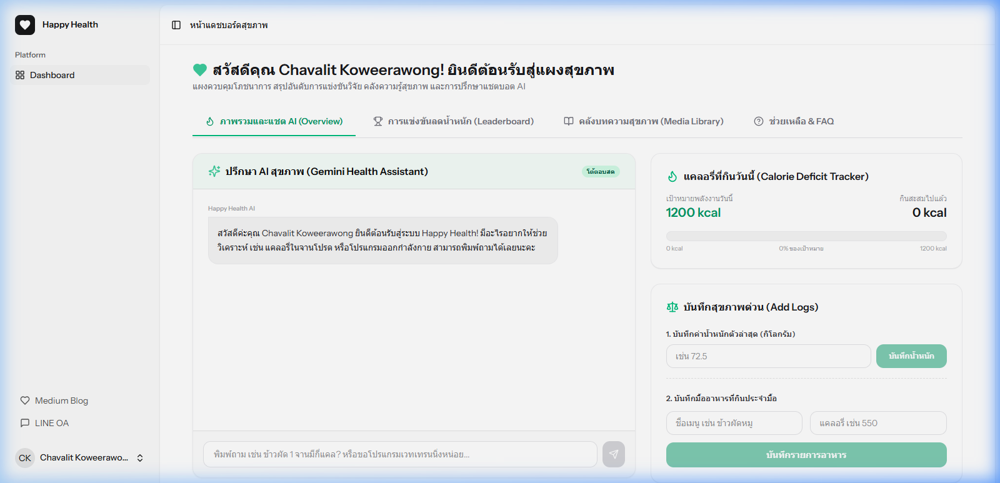
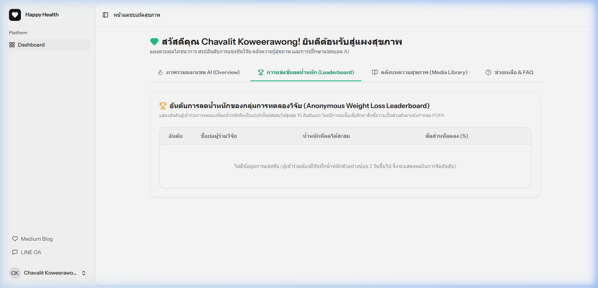
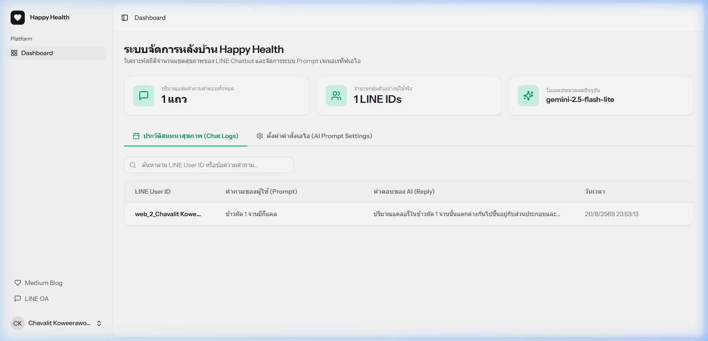

# คู่มือการใช้งานระบบเว็บไซต์ (Website User Manual) - Happy Health Happy Heart

ที่อยู่เว็บไซต์อย่างเป็นทางการ: **[https://happyhealthhappyheart.com](https://happyhealthhappyheart.com)**

ระบบเว็บของโครงการ **Happy Health Happy Heart** ได้รับการพัฒนาด้วยเทคโนโลยี Laravel 12 ร่วมกับ Inertia.js (React + TypeScript) และตกแต่งสไตล์ด้วย Tailwind CSS v4 แบ่งระดับผู้ใช้งานออกเป็น 2 กลุ่มหลัก คือ **ผู้ใช้งานทั่วไป (General User)** และ **ผู้ดูแลระบบ (Admin)** โดยระบบจะทำการตรวจสอบและนำทางสิทธิ์การแสดงหน้าจอให้โดยอัตนัยเมื่อทำการล็อกอิน

---

## 🏠 หน้าแรกของเว็บไซต์ (Home Landing Page)

หน้าแรกของเว็บไซต์จัดทำขึ้นเพื่อนำเสนอเป้าหมายโครงการ ผลสัมฤทธิ์งานวิจัย R&D คุณสมบัติเด่นของเอไอ และขั้นตอนการสแกน QR Code เพื่อเพิ่มเพื่อนใน LINE OA (`@203glfet`)

---

## 👥 1. สำหรับผู้ใช้งานทั่วไป (General User Dashboard)

เมื่อผู้ใช้งานเข้าสู่ระบบแล้ว (`chavalit@vru.ac.th`) ระบบจะนำทางมายังแผงพอร์ตทัลดูแลสุขภาพซึ่งจะแบ่งออกเป็น 4 แท็บเมนูหลัก:

### แท็บที่ 1: ข้อมูลสุขภาพและระบบแชต (Overview & Chat)

* **เครื่องมือคำนวณสัดส่วนร่างกาย (BMR & TDEE Calculator)**: 
  * ให้ป้อนข้อมูลสัดส่วนร่างกายปัจจุบัน ได้แก่ **เพศสภาพ, ส่วนสูง (ซม.), อายุ (ปี) และระดับกิจกรรมประจำวัน** จากนั้นกดปุ่ม **"อัปเดตและคำนวณเป้าหมาย"**
  * ระบบจะคำนวณหาค่าอัตราการเผาผลาญพื้นฐาน (BMR) และการใช้พลังงานทั้งหมดต่อวัน (TDEE) พร้อมกำหนดแคลอรี่เป้าหมายสำหรับการควบคุมน้ำหนัก (Caloric Deficit - ลดลง 500 kcal จาก TDEE) ให้โดยอัตโนมัติ
* **การจดบันทึกโภชนาการและน้ำหนักตัว (Daily Logger)**:
  * **บันทึกน้ำหนักตัว (กก.)**: ใส่ตัวเลขน้ำหนักตัวปัจจุบันแล้วกดบันทึก ข้อมูลจะถูกเก็บไว้ใช้คำนวณอันดับลีดเดอร์บอร์ด
  * **บันทึกมื้ออาหาร (แคลอรี่)**: กรอกปริมาณแคลอรี่ของอาหารที่รับประทานในมื้อนั้น ๆ เพื่อนำมารวมเป็นพลังงานรับเข้าประจำวัน
* **แถบเปรียบเทียบแคลอรี่และพลังงานติดลบ (Calorie Deficit Tracker)**:
  * หน้าจอจะแสดงวงล้อเปอร์เซ็นต์พลังงานรับเข้าสะสมเทียบกับเป้าหมายแคลอรี่ควบคุม
  * แสดงแถบพลังงานผลต่าง (Deficit State) ว่าในวันนั้น ๆ ร่างกายได้รับพลังงานต่ำกว่าเป้าหมายหรือไม่ เพื่อช่วยควบคุมความสม่ำเสมอ
* **ห้องสนทนาสดกับ AI บนเว็บไซต์ (Web Chat Widget)**:
  * ในแถบขวาของหน้าจอ ผู้ใช้สามารถพิมพ์คำถามสุขภาพ โภชนาการ หรือการออกกำลังกายส่งหาเอไอระบบเว็บได้โดยตรง ซึ่งเอไอจะตอบกลับอย่างรวดเร็วโดยประมวลผลผ่านโมเดล Google Gemini 3.6 Flash

---

### แท็บที่ 2: การแข่งขันลดน้ำหนัก (Leaderboard)

* **กระดานผู้นำผลงานลดน้ำหนัก (Weight Loss Rankings)**:
  * ระบบดึงข้อมูลน้ำหนักแรกสุด (Start Weight) และน้ำหนักล่าสุด (Current Weight) ของผู้แข่งขันทุกคนมาคิดคำนวณร้อยละส่วนต่างน้ำหนักที่ลดได้ (%)
  * นำผลเปอร์เซ็นต์การลดน้ำหนักมาจัดลำดับ Top 10 พร้อมประดับสัญลักษณ์เหรียญทอง (🥇), เหรียญเงิน (🥈), และเหรียญทองแดง (🥉)
* **การคุ้มครองข้อมูลส่วนบุคคล (PDPA Compliance)**:
  * รายชื่อผู้แข่งขันบนกระดานผู้นำจะถูกแปลงเป็นอักษรย่อนามแฝงเสมอ (เช่น *สมชาย ปานดี* $\rightarrow$ *ส. ป.*) เพื่อป้องกันการเปิดเผยข้อมูลส่วนบุคคลและข้อมูลสุขภาพของกลุ่มตัวอย่าง

---

### แท็บที่ 3: คลังบทความสุขภาพ (Digital Media Hub)

* **แหล่งความรู้เชิงโภชนาการและกีฬา**:
  * คลังบทความนี้จัดสรรขึ้นตามหลักวัตถุประสงค์งานวิจัย โดยดึงข้อมูลบทความล่าสุดผ่าน RSS Feed จาก Publication **https://medium.com/happy-health-happy-heart** โดยตรง
  * แสดงรายการบทความพร้อมรูปภาพหน้าปกจริง เช่น *ค่าดัชนีมวลกาย (BMI)*, *อาหารแลกเปลี่ยน (Food Exchange Lists)*, *Low Carbohydrate Diets*, *Intermittent Fasting (IF)*, *Ketogenic Diet*, *Mediterranean Diet* และ *อาหารลดหวาน มัน เค็ม*
  * สามารถกดที่การ์ดบทความเพื่อเชื่อมโยงไปอ่านฉบับเต็มบน Medium ได้ทันที

---

### แท็บที่ 4: ช่วยเหลือ & FAQ (Helpdesk & FAQ)

* **คู่มือการแก้ไขปัญหาเบื้องต้น (Accordion FAQs)**:
  * รวบรวมคำถามที่พบบ่อย เช่น ขั้นตอนการใช้งานแชตบอต หรือคำแนะนำด้านความปลอดภัย
* **แบบฟอร์มส่งตั๋วสนับสนุนทางเทคนิค (Support Ticket Form)**:
  * หากพบการติดขัดในการเข้าถึงหรือระบบทำงานผิดพลาด ผู้ร่วมวิจัยสามารถกรอกประเภทปัญหาและรายละเอียดส่งเข้าสู่ฐานข้อมูลได้ทันที โดยระบบจะกรอกข้อมูลชื่อและอีเมลให้อัตโนมัติเพื่อให้ผู้ดูแลติดต่อกลับได้สะดวก

---

## 👑 2. สำหรับผู้ดูแลระบบ (Admin Dashboard)

ผู้ดูแลระบบที่ล็อกอินด้วยอีเมลผู้จัดทำโครงการวิจัยหลักคือ **`chavalit.kow@gmail.com`** เท่านั้นที่จะได้รับการอนุญาตให้เข้าถึงแดชบอร์ดหลังบ้านได้ โดยมีฟังก์ชันควบคุมดังนี้:

### 📊 แผงวิเคราะห์และสถิติภาพรวม (Usage Statistics)
* **สถิติสะสมคำขอ (Total Requests Logged)**: แสดงการ์ดสถิติรวมจำนวนคำสนทนาทั้งหมดที่คุยผ่านแชตบอต LINE และระบบเว็บ
* **กลุ่มตัวอย่างในระบบ (Active Sample Size)**: แสดงสถิติจำนวนผู้ใช้งานไม่ซ้ำคน (Unique User IDs) เพื่อติดตามปริมาณปฏิสัมพันธ์

### 🔍 ตารางสืบค้นประวัติคำถามแคลอรี่อาหาร (Usage Logs Grid)
* **ระบบค้นหาความเร็วสูง (Real-time Search)**: ผู้ดูแลสามารถพิมพ์คำค้นหา เช่น ชื่อเมนูอาหาร, ชื่อผู้ส่งคำถาม, หรือ ID ข้อความ เพื่อครองดูเฉพาะแถวประวัติที่สนใจ
* **ระบบแบ่งหน้าแสดงผล (Pagination)**: แบ่งหน้าประวัติรายการละ 15 แถวอัตโนมัติ เพื่อป้องกันการโหลดข้อมูลหนัก
* **กล่องเปิดขยายรายละเอียดสนทนา (Chat Drawer Modal)**: เมื่อคลิกแถวใด ๆ ในตารางหลังบ้าน ระบบจะดึงข้อมูลการโต้ตอบแบบเต็ม เช่น คำถามดั้งเดิมของผู้ใช้งาน และคำแนะนำทางสุขภาพที่ Generative AI วิเคราะห์ตอบกลับไป มาแสดงผลบนหน้าต่างเลื่อนขนาดใหญ่

### ⚙️ แผงควบคุมระบบคำสั่งเอไอเชิงลึก (AI Prompts & Model Settings)
* **แก้ไขคำสั่งควบคุมพฤติกรรม (System Instruction Editor)**: ผู้ดูแลระบบสามารถเขียนปรับแก้บทบาทหลักของเอไอ เช่น การบังคับให้เอไอสวมบทบาทเป็น "นักโภชนาการมืออาชีพและผู้ช่วยแนะนำควบคุมน้ำหนักตัว" ได้จากกล่องป้อนข้อความ
* **กล่องข้อจำกัดคำตอบ (Final Constraints)**: สามารถใส่ชุดควบคุมความกระชับ เช่น บังคับลงท้ายไม่เกิน 1 ย่อหน้า หรือจำกัดไม่ให้ตอบข้อมูลนอกเหนือประเด็นสุขภาพ
* **ระบบปรับสลับโมเดลอัจฉริยะ (AI Model Selector)**: สามารถเลือกกดสลับระหว่างโมเดลประมวลผล:
  * **`gemini-3.6-flash`** (เน้นความเร็วระดับวินาที อัตราการประมวลผลสูง - แนะนำ)
  * **`gemini-1.5-flash`** (รุ่นเสถียรดั้งเดิม สำหรับการทดสอบรองรับระบบทั่วไป)
* กดปุ่ม **"บันทึกการตั้งค่าระบบเอไอ"** เพื่อเขียนข้อมูลทับลงในหน่วยบันทึก JSON ซึ่งจะส่งผลต่อการตอบสนองของแชตบอตทันทีโดยไม่ต้องรันเขียนโค้ดใหม่
